# BÁO CÁO ĐỒ ÁN

## HỆ THỐNG QUẢN LÝ VÀ BÁN HÀNG TRỰC TUYẾN

---

# 1. Trang bìa thông tin

## Tên đề tài

**HỆ THỐNG QUẢN LÝ VÀ BÁN HÀNG TRỰC TUYẾN**

## Sinh viên thực hiện

| STT | Họ và tên | Mã sinh viên |
| --- | --- | --- |
| 1 | Đồng Thị Ánh | 23013883 |
| 2 | Bùi Thị Hồng Tươi | 23015124 |
| 3 | Nguyễn Minh Phương | 23015738 |

## Công nghệ sử dụng

| Nhóm công nghệ | Công nghệ |
| --- | --- |
| Backend | Laravel Framework, Laravel Fortify, Eloquent ORM |
| Frontend | Blade Template, Livewire page components, Flux UI, Tailwind CSS, Vite |
| Cơ sở dữ liệu | MySQL theo cấu hình `.env`, migration Laravel |
| Xác thực và bảo mật | Laravel Fortify, CSRF, middleware, password hashing, email verification |
| Tích hợp bên ngoài | GroqAI API cho Chatbox AI |
| Quản lý tài nguyên | Laravel Storage cho ảnh sản phẩm |

## Mục tiêu hệ thống

Hệ thống được xây dựng nhằm cung cấp một nền tảng bán hàng trực tuyến cho khách hàng và công cụ quản trị cho người quản trị. Khách hàng có thể xem sản phẩm, tìm kiếm, thêm vào giỏ hàng, đặt hàng theo hình thức thanh toán khi nhận hàng và theo dõi trạng thái đơn hàng. Quản trị viên có thể quản lý danh mục, sản phẩm, hình ảnh, tồn kho, đơn hàng, người dùng, dashboard thống kê và cấu hình Chatbox AI.

---

# 2. Giới thiệu dự án

## 2.1. Lý do chọn đề tài

Mua bán trực tuyến đã trở thành một hình thức kinh doanh phổ biến nhờ khả năng tiếp cận khách hàng rộng, giảm chi phí vận hành và hỗ trợ quản lý đơn hàng tập trung. Đối với các cửa hàng vừa và nhỏ, một hệ thống bán hàng trực tuyến không chỉ giúp giới thiệu sản phẩm mà còn hỗ trợ quản lý tồn kho, theo dõi trạng thái đơn hàng, thống kê doanh thu và chăm sóc khách hàng.

Đề tài **Hệ thống quản lý và bán hàng trực tuyến** được lựa chọn vì phù hợp với nhu cầu thực tế, đồng thời giúp vận dụng các kiến thức về lập trình web, cơ sở dữ liệu, xác thực người dùng, phân quyền, quản trị dữ liệu và tích hợp dịch vụ AI.

## 2.2. Mục tiêu xây dựng hệ thống

Hệ thống hướng đến các mục tiêu chính:

- Xây dựng website bán hàng trực tuyến có giao diện khách hàng và giao diện quản trị riêng.
- Cho phép khách hàng xem danh sách sản phẩm, lọc và tìm kiếm sản phẩm, xem chi tiết sản phẩm.
- Hỗ trợ khách hàng quản lý giỏ hàng, địa chỉ nhận hàng, đặt hàng COD và theo dõi lịch sử trạng thái đơn hàng.
- Hỗ trợ quản trị viên quản lý danh mục, sản phẩm, hình ảnh sản phẩm, tồn kho, đơn hàng và người dùng.
- Cung cấp dashboard thống kê các chỉ số cơ bản như tổng sản phẩm, tổng đơn hàng, tổng người dùng, doanh thu, sản phẩm bán chạy và đơn hàng theo trạng thái.
- Tích hợp Chatbox AI sử dụng GroqAI API để tư vấn sản phẩm, trả lời FAQ và hỗ trợ tra cứu đơn hàng của người dùng hiện tại.

## 2.3. Đối tượng sử dụng

| Đối tượng | Mô tả |
| --- | --- |
| Khách hàng | Người truy cập website để xem sản phẩm, mua hàng, quản lý địa chỉ và theo dõi đơn hàng. |
| Quản trị viên | Người quản lý dữ liệu sản phẩm, kho, đơn hàng, người dùng, dashboard và cấu hình AI. |
| Chatbox AI/GroqAI API | Dịch vụ hỗ trợ trả lời câu hỏi và tư vấn sản phẩm dựa trên prompt ngữ cảnh do hệ thống xây dựng. |

## 2.4. Phạm vi triển khai

Trong phạm vi source code hiện tại, hệ thống đã triển khai:

- Xác thực người dùng bằng Laravel Fortify.
- Phân quyền cơ bản bằng bảng `roles`, quan hệ `users.role_id` và middleware `admin`.
- Giao diện khách hàng gồm cửa hàng, chi tiết sản phẩm, giỏ hàng, checkout, địa chỉ, lịch sử đơn hàng.
- Giao diện quản trị gồm dashboard, danh mục, sản phẩm, kho, đơn hàng, người dùng, Chatbox AI.
- Quy trình đặt hàng COD, tạo đơn hàng, tạo chi tiết đơn hàng, trừ tồn kho và ghi lịch sử trạng thái.
- Chatbox AI gọi GroqAI API, dùng dữ liệu sản phẩm/FAQ/đơn hàng làm ngữ cảnh và lưu lịch sử hội thoại theo `user_id` và `session_id`.

Các chức năng như thanh toán trực tuyến, mã giảm giá, đánh giá sản phẩm, bình luận, wishlist, tích hợp vận chuyển và API mobile chưa được triển khai trong phạm vi hiện tại. Các chức năng này được trình bày ở phần hướng phát triển.

## 2.5. Ý nghĩa thực tiễn

Hệ thống giúp mô phỏng một quy trình bán hàng trực tuyến thực tế. Thông qua hệ thống, cửa hàng có thể quản lý dữ liệu sản phẩm và đơn hàng tập trung, giảm thao tác thủ công khi theo dõi tồn kho, hỗ trợ khách hàng theo dõi đơn hàng rõ ràng hơn và tận dụng Chatbox AI để giảm tải các câu hỏi lặp lại.

---

# 3. Khảo sát và phân tích hệ thống

## 3.1. Thực trạng mua bán trực tuyến

Trong hoạt động kinh doanh hiện nay, khách hàng có xu hướng tìm kiếm sản phẩm trên website trước khi quyết định mua hàng. Các cửa hàng cần một hệ thống có khả năng hiển thị sản phẩm rõ ràng, cập nhật tồn kho, tiếp nhận đơn hàng và phản hồi thông tin đơn hàng nhanh chóng. Nếu thiếu công cụ quản lý tập trung, cửa hàng dễ gặp các vấn đề như nhầm lẫn số lượng tồn, chậm cập nhật trạng thái đơn, khó tổng hợp doanh thu và khó chăm sóc khách hàng.

## 3.2. Vấn đề cần giải quyết

Hệ thống cần giải quyết các vấn đề sau:

- Khách hàng cần xem sản phẩm, lọc sản phẩm và biết trạng thái còn hàng/hết hàng.
- Khách hàng cần đặt hàng, nhập hoặc chọn địa chỉ giao hàng và theo dõi trạng thái xử lý.
- Người quản trị cần quản lý danh mục, sản phẩm, giá bán, mô tả, hình ảnh và tồn kho.
- Người quản trị cần cập nhật trạng thái đơn hàng và lưu lịch sử thay đổi.
- Người quản trị cần quản lý người dùng, khóa/mở khóa tài khoản và gán vai trò.
- Hệ thống cần hỗ trợ khách hàng bằng Chatbox AI nhưng vẫn bảo mật API key và không bịa thông tin đơn hàng.

## 3.3. Giải pháp hệ thống đề xuất

Source code hiện tại triển khai giải pháp bằng Laravel theo mô hình MVC:

- `routes/web.php` định nghĩa route cho storefront, giỏ hàng, checkout, đơn hàng, địa chỉ, AI chat và nhóm route `/admin`.
- `app/Http/Controllers` xử lý các nghiệp vụ phía khách hàng và quản trị.
- `app/Models` định nghĩa dữ liệu và quan hệ Eloquent.
- `database/migrations` tạo bảng dữ liệu.
- `resources/views` chứa giao diện Blade cho khách hàng và quản trị.
- `app/Services/GroqChatService.php` đóng gói logic gọi GroqAI API.
- `app/Http/Middleware/EnsureUserIsAdmin.php` và `EnsureUserIsActive.php` bảo vệ quyền truy cập và trạng thái tài khoản.

## 3.4. Các tác nhân chính của hệ thống

| Tác nhân | Vai trò trong hệ thống |
| --- | --- |
| Khách hàng | Xem sản phẩm, quản lý giỏ hàng, đặt hàng, quản lý địa chỉ, theo dõi đơn hàng, sử dụng Chatbox AI. |
| Quản trị viên | Quản lý sản phẩm, danh mục, kho, đơn hàng, người dùng, dashboard và cấu hình AI. |
| Chatbox AI/GroqAI API | Nhận prompt từ hệ thống, xử lý câu hỏi ngôn ngữ tự nhiên và trả lời cho khách hàng. |

Hệ thống sử dụng hai vai trò nghiệp vụ chính là `admin` và `customer`. Các quyền truy cập quản trị được kiểm soát thông qua middleware và quan hệ vai trò của tài khoản.

---

# 4. Yêu cầu hệ thống

## 4.1. Yêu cầu chức năng

### 4.1.1. Chức năng xác thực và tài khoản

- Đăng ký tài khoản bằng Laravel Fortify.
- Đăng nhập, đăng xuất.
- Gửi email xác thực tài khoản theo cấu hình Fortify.
- Đặt lại mật khẩu.
- Cập nhật thông tin hồ sơ trong trang settings.
- Đổi mật khẩu.
- Tự động gán vai trò khách hàng cho tài khoản mới qua `CreateNewUser`.
- Middleware tự động đăng xuất tài khoản bị khóa.

### 4.1.2. Chức năng khách hàng

- Xem danh sách sản phẩm tại route `/`.
- Tìm kiếm sản phẩm theo tên.
- Lọc sản phẩm theo danh mục.
- Lọc sản phẩm theo khoảng giá.
- Xem chi tiết sản phẩm theo slug.
- Xem trạng thái còn hàng/hết hàng dựa trên `stock_quantity`.
- Thêm sản phẩm vào giỏ hàng.
- Cập nhật số lượng sản phẩm trong giỏ hàng.
- Xóa sản phẩm khỏi giỏ hàng.
- Xem tổng tiền tạm tính.
- Quản lý nhiều địa chỉ nhận hàng.
- Đặt hàng theo hình thức COD.
- Xem lịch sử đơn hàng.
- Xem chi tiết đơn hàng và timeline trạng thái.
- Hủy đơn hàng nếu đơn đang ở trạng thái `pending` hoặc `confirmed`.
- Sử dụng Chatbox AI ở giao diện khách hàng.

### 4.1.3. Chức năng quản trị

- Truy cập dashboard quản trị qua `/admin`.
- Xem thống kê tổng sản phẩm, tổng đơn hàng, tổng người dùng, doanh thu.
- Xem đơn hàng mới nhất.
- Xem sản phẩm sắp hết hàng.
- Xem số lượng đơn hàng theo trạng thái.
- Xem doanh thu 7 ngày gần nhất.
- Xem sản phẩm bán chạy dựa trên `order_items`.
- CRUD danh mục sản phẩm.
- Không cho xóa danh mục đang có sản phẩm.
- CRUD sản phẩm.
- Upload ảnh sản phẩm hoặc thêm ảnh bằng URL.
- Chọn ảnh đại diện sản phẩm.
- Xóa ảnh sản phẩm.
- Tìm kiếm và lọc sản phẩm theo danh mục/trạng thái.
- Quản lý tồn kho và ngưỡng sắp hết hàng.
- Xem danh sách đơn hàng, lọc theo trạng thái và tìm kiếm theo mã đơn/khách hàng.
- Xem chi tiết đơn hàng.
- Cập nhật trạng thái đơn hàng.
- Ghi chú xử lý đơn hàng.
- Lưu lịch sử thay đổi trạng thái.
- Quản lý người dùng, cập nhật thông tin, gán vai trò, khóa/mở khóa tài khoản.
- Quản lý cấu hình AI: bật/tắt, model, system prompt, FAQ.
- Xem và xóa lịch sử hội thoại AI.

### 4.1.4. Chức năng Chatbox AI

- Widget Chatbox AI hiển thị trên layout khách hàng.
- Gửi câu hỏi tới endpoint `POST /ai/chat`.
- Hệ thống lấy dữ liệu sản phẩm đang active, FAQ từ `ai_settings` và đơn hàng của người dùng hiện tại để tạo prompt.
- Gọi GroqAI API qua `Http::withToken`.
- Lưu hội thoại vào `ai_conversations`.
- Lưu `user_id` nếu đã đăng nhập và `session_id` cho cả khách chưa đăng nhập.
- Khi reload hoặc chuyển tab, lịch sử chat của session hiện tại được hiển thị lại.

## 4.2. Yêu cầu phi chức năng

| Nhóm yêu cầu | Mô tả đáp ứng trong source code |
| --- | --- |
| Bảo mật | Dùng Laravel Fortify, password hashing, CSRF token, validation, middleware `auth`, `verified`, `admin`, kiểm tra quyền sở hữu địa chỉ/đơn hàng. |
| Hiệu năng | Danh sách sản phẩm, đơn hàng, user, danh mục dùng phân trang; Eloquent eager loading được dùng ở nhiều truy vấn như sản phẩm kèm danh mục/ảnh, đơn hàng kèm user/items. |
| Dễ sử dụng | Giao diện Blade/Tailwind tách rõ khách hàng và quản trị; có flash message, badge trạng thái, form lọc/tìm kiếm. |
| Dễ bảo trì | Code chia theo MVC, model quan hệ rõ ràng, service riêng cho GroqAI, middleware riêng cho admin và tài khoản bị khóa. |
| Khả năng mở rộng | Có cấu trúc bảng đơn hàng, sản phẩm, trạng thái, AI settings; có thể mở rộng thanh toán online, mã giảm giá, đánh giá, wishlist, mobile API. |
| Tương thích giao diện | Tailwind CSS, Vite, layout responsive cơ bản, sidebar quản trị collapsible từ Flux/Livewire starter. |
| Sao lưu và quản lý dữ liệu | Dữ liệu quản lý qua migration/seeder; database có thể sao lưu theo cơ chế MySQL. |

---

# 5. Đặc tả Use Case

## UC01 - Đăng ký tài khoản

| Thành phần | Nội dung |
| --- | --- |
| Mã use case | UC01 |
| Tên use case | Đăng ký tài khoản |
| Tác nhân | Khách hàng |
| Mô tả | Khách hàng tạo tài khoản mới để sử dụng chức năng giỏ hàng, đặt hàng và quản lý đơn hàng. |
| Điều kiện tiên quyết | Người dùng chưa đăng nhập. |
| Luồng xử lý chính | 1. Người dùng mở trang đăng ký. 2. Nhập họ tên, email, mật khẩu. 3. Fortify validate dữ liệu. 4. `CreateNewUser` tạo user và gán role `customer`. 5. Hệ thống đăng nhập hoặc chuyển hướng theo cấu hình Fortify. |
| Luồng thay thế/ngoại lệ | Email đã tồn tại hoặc mật khẩu không hợp lệ thì hệ thống hiển thị lỗi validation. |
| Kết quả đầu ra | Tài khoản khách hàng được tạo trong bảng `users`. |

## UC02 - Đăng nhập

| Thành phần | Nội dung |
| --- | --- |
| Mã use case | UC02 |
| Tên use case | Đăng nhập |
| Tác nhân | Khách hàng, Quản trị viên |
| Mô tả | Người dùng đăng nhập để truy cập các chức năng yêu cầu xác thực. |
| Điều kiện tiên quyết | Người dùng đã có tài khoản. |
| Luồng xử lý chính | 1. Người dùng mở trang đăng nhập. 2. Nhập email và mật khẩu. 3. Fortify kiểm tra thông tin. 4. Hệ thống tạo session. 5. Route `/dashboard` điều hướng admin tới `/admin`, khách hàng về trang chủ. |
| Luồng thay thế/ngoại lệ | Thông tin sai bị từ chối; tài khoản bị khóa sẽ bị middleware `EnsureUserIsActive` đăng xuất và chuyển về login. |
| Kết quả đầu ra | Người dùng đăng nhập thành công và có session. |

## UC03 - Xem danh sách sản phẩm

| Thành phần | Nội dung |
| --- | --- |
| Mã use case | UC03 |
| Tên use case | Xem danh sách sản phẩm |
| Tác nhân | Khách hàng, Khách chưa đăng nhập |
| Mô tả | Người dùng xem danh sách sản phẩm đang active tại trang chủ. |
| Điều kiện tiên quyết | Không yêu cầu đăng nhập. |
| Luồng xử lý chính | 1. Người dùng truy cập `/`. 2. `StorefrontController@index` lấy danh mục active và sản phẩm active. 3. Hệ thống phân trang sản phẩm. 4. Giao diện `store/index.blade.php` hiển thị danh sách. |
| Luồng thay thế/ngoại lệ | Nếu không có sản phẩm phù hợp, giao diện hiển thị thông báo không tìm thấy sản phẩm. |
| Kết quả đầu ra | Danh sách sản phẩm được hiển thị. |

## UC04 - Xem chi tiết sản phẩm

| Thành phần | Nội dung |
| --- | --- |
| Mã use case | UC04 |
| Tên use case | Xem chi tiết sản phẩm |
| Tác nhân | Khách hàng, Khách chưa đăng nhập |
| Mô tả | Người dùng xem thông tin chi tiết, ảnh, giá, mô tả và tồn kho của sản phẩm. |
| Điều kiện tiên quyết | Sản phẩm tồn tại và `is_active = true`. |
| Luồng xử lý chính | 1. Người dùng chọn sản phẩm. 2. Route `products/{product:slug}` truyền model theo slug. 3. Controller load danh mục và ảnh. 4. View hiển thị chi tiết sản phẩm và sản phẩm liên quan. |
| Luồng thay thế/ngoại lệ | Sản phẩm không active thì hệ thống trả 404. |
| Kết quả đầu ra | Chi tiết sản phẩm được hiển thị. |

## UC05 - Thêm sản phẩm vào giỏ hàng

| Thành phần | Nội dung |
| --- | --- |
| Mã use case | UC05 |
| Tên use case | Thêm sản phẩm vào giỏ hàng |
| Tác nhân | Khách hàng |
| Mô tả | Khách hàng thêm sản phẩm còn hàng vào giỏ. |
| Điều kiện tiên quyết | Khách hàng đã đăng nhập, sản phẩm active và số lượng không vượt tồn kho. |
| Luồng xử lý chính | 1. Khách hàng nhập số lượng. 2. Gửi `POST /cart/{product}`. 3. `CartController@store` validate số lượng. 4. Hệ thống tạo cart nếu chưa có. 5. Thêm hoặc cộng dồn cart item. |
| Luồng thay thế/ngoại lệ | Nếu vượt tồn kho, hệ thống trả thông báo lỗi. Nếu sản phẩm không active, hệ thống trả 404. |
| Kết quả đầu ra | Sản phẩm xuất hiện trong giỏ hàng. |

## UC06 - Cập nhật giỏ hàng

| Thành phần | Nội dung |
| --- | --- |
| Mã use case | UC06 |
| Tên use case | Cập nhật giỏ hàng |
| Tác nhân | Khách hàng |
| Mô tả | Khách hàng thay đổi số lượng hoặc xóa sản phẩm khỏi giỏ hàng. |
| Điều kiện tiên quyết | Khách hàng đã đăng nhập và có sản phẩm trong giỏ. |
| Luồng xử lý chính | 1. Khách hàng mở `/cart`. 2. Thay đổi số lượng hoặc chọn xóa. 3. Controller validate số lượng và tồn kho. 4. Cập nhật hoặc xóa cart item. 5. Giao diện tính lại tổng tiền. |
| Luồng thay thế/ngoại lệ | Nếu số lượng vượt tồn kho, hệ thống không cập nhật và hiển thị lỗi. |
| Kết quả đầu ra | Giỏ hàng được cập nhật đúng. |

## UC07 - Đặt hàng

| Thành phần | Nội dung |
| --- | --- |
| Mã use case | UC07 |
| Tên use case | Đặt hàng |
| Tác nhân | Khách hàng |
| Mô tả | Khách hàng xác nhận giỏ hàng và tạo đơn hàng COD. |
| Điều kiện tiên quyết | Khách hàng đã đăng nhập, giỏ hàng không rỗng, sản phẩm đủ tồn kho. |
| Luồng xử lý chính | 1. Khách hàng mở trang checkout. 2. Chọn địa chỉ có sẵn hoặc nhập địa chỉ mới. 3. Gửi xác nhận đặt hàng. 4. `CheckoutController@store` chạy transaction. 5. Hệ thống kiểm tra tồn kho, tạo `orders`, tạo `order_items`, trừ tồn kho, ghi `order_status_histories`, xóa cart items. |
| Luồng thay thế/ngoại lệ | Nếu giỏ rỗng hoặc sản phẩm không đủ tồn kho, hệ thống trả lỗi 422/thông báo lỗi. |
| Kết quả đầu ra | Đơn hàng được tạo ở trạng thái `pending`. |

## UC08 - Xem lịch sử đơn hàng

| Thành phần | Nội dung |
| --- | --- |
| Mã use case | UC08 |
| Tên use case | Xem lịch sử đơn hàng |
| Tác nhân | Khách hàng |
| Mô tả | Khách hàng xem các đơn hàng đã đặt. |
| Điều kiện tiên quyết | Khách hàng đã đăng nhập. |
| Luồng xử lý chính | 1. Khách hàng mở `/orders`. 2. `CustomerOrderController@index` lấy đơn của user hiện tại. 3. View hiển thị mã đơn, ngày đặt, số sản phẩm, tổng tiền và trạng thái. |
| Luồng thay thế/ngoại lệ | Nếu chưa có đơn, giao diện hiển thị thông báo chưa có đơn hàng. |
| Kết quả đầu ra | Danh sách đơn hàng của khách hàng được hiển thị. |

## UC09 - Theo dõi trạng thái đơn hàng

| Thành phần | Nội dung |
| --- | --- |
| Mã use case | UC09 |
| Tên use case | Theo dõi trạng thái đơn hàng |
| Tác nhân | Khách hàng |
| Mô tả | Khách hàng xem chi tiết đơn và lịch sử trạng thái. |
| Điều kiện tiên quyết | Khách hàng đã đăng nhập và đơn hàng thuộc về khách hàng. |
| Luồng xử lý chính | 1. Khách hàng chọn chi tiết đơn. 2. Controller kiểm tra `order.user_id === auth()->id()`. 3. Load `items` và `histories.changer`. 4. View hiển thị sản phẩm, giao hàng, tổng tiền và timeline trạng thái. |
| Luồng thay thế/ngoại lệ | Nếu truy cập đơn của người khác, hệ thống trả 403. |
| Kết quả đầu ra | Timeline trạng thái đơn hàng được hiển thị. |

## UC10 - Quản lý sản phẩm

| Thành phần | Nội dung |
| --- | --- |
| Mã use case | UC10 |
| Tên use case | Quản lý sản phẩm |
| Tác nhân | Quản trị viên |
| Mô tả | Quản trị viên thêm, sửa, xóa, tìm kiếm, lọc và quản lý ảnh sản phẩm. |
| Điều kiện tiên quyết | Người dùng đăng nhập, xác thực email và có role `admin`. |
| Luồng xử lý chính | 1. Admin mở `/admin/products`. 2. Hệ thống hiển thị danh sách sản phẩm kèm danh mục và ảnh đại diện. 3. Admin tạo/sửa sản phẩm với danh mục, SKU, giá, mô tả, tồn kho. 4. Admin upload ảnh hoặc nhập URL ảnh. 5. Hệ thống lưu vào `products` và `product_images`. |
| Luồng thay thế/ngoại lệ | Dữ liệu không hợp lệ, tên/SKU trùng hoặc ảnh sai định dạng thì validation báo lỗi. |
| Kết quả đầu ra | Dữ liệu sản phẩm được cập nhật. |

## UC11 - Quản lý danh mục

| Thành phần | Nội dung |
| --- | --- |
| Mã use case | UC11 |
| Tên use case | Quản lý danh mục |
| Tác nhân | Quản trị viên |
| Mô tả | Quản trị viên tạo, sửa, xóa và bật/tắt danh mục. |
| Điều kiện tiên quyết | Admin đã đăng nhập. |
| Luồng xử lý chính | 1. Admin mở `/admin/categories`. 2. Hệ thống hiển thị danh mục và số lượng sản phẩm. 3. Admin thêm hoặc sửa tên, mô tả, trạng thái. 4. Hệ thống tự tạo slug bằng `Str::slug`. |
| Luồng thay thế/ngoại lệ | Nếu xóa danh mục đang có sản phẩm, hệ thống không cho xóa. |
| Kết quả đầu ra | Danh mục được quản lý đúng. |

## UC12 - Quản lý đơn hàng

| Thành phần | Nội dung |
| --- | --- |
| Mã use case | UC12 |
| Tên use case | Quản lý đơn hàng |
| Tác nhân | Quản trị viên |
| Mô tả | Quản trị viên xem danh sách, tìm kiếm, lọc và xem chi tiết đơn hàng. |
| Điều kiện tiên quyết | Admin đã đăng nhập. |
| Luồng xử lý chính | 1. Admin mở `/admin/orders`. 2. Hệ thống lấy đơn hàng kèm user. 3. Admin tìm kiếm theo mã đơn, người nhận, tên/email user hoặc lọc trạng thái. 4. Admin mở chi tiết đơn. |
| Luồng thay thế/ngoại lệ | Nếu không có đơn phù hợp, bảng hiển thị trạng thái rỗng. |
| Kết quả đầu ra | Admin xem được danh sách và chi tiết đơn hàng. |

## UC13 - Cập nhật trạng thái đơn hàng

| Thành phần | Nội dung |
| --- | --- |
| Mã use case | UC13 |
| Tên use case | Cập nhật trạng thái đơn hàng |
| Tác nhân | Quản trị viên |
| Mô tả | Quản trị viên thay đổi trạng thái xử lý đơn hàng và ghi lịch sử. |
| Điều kiện tiên quyết | Admin đã đăng nhập và đơn hàng tồn tại. |
| Luồng xử lý chính | 1. Admin mở chi tiết đơn. 2. Chọn trạng thái mới. 3. Nhập ghi chú xử lý nếu cần. 4. `Admin\OrderController@update` validate trạng thái. 5. Hệ thống cập nhật đơn và ghi `order_status_histories`. |
| Luồng thay thế/ngoại lệ | Không thể mở lại đơn đã hủy. Nếu chuyển sang `cancelled`, hệ thống hoàn lại tồn kho cho sản phẩm còn liên kết. |
| Kết quả đầu ra | Trạng thái mới được lưu và khách hàng nhìn thấy trong timeline. |

## UC14 - Quản lý người dùng

| Thành phần | Nội dung |
| --- | --- |
| Mã use case | UC14 |
| Tên use case | Quản lý người dùng |
| Tác nhân | Quản trị viên |
| Mô tả | Quản trị viên tìm kiếm, cập nhật thông tin, gán vai trò và khóa/mở khóa tài khoản. |
| Điều kiện tiên quyết | Admin đã đăng nhập. |
| Luồng xử lý chính | 1. Admin mở `/admin/users`. 2. Hệ thống hiển thị user kèm role. 3. Admin cập nhật tên, email, phone, role và trạng thái khóa. 4. Hệ thống validate và lưu dữ liệu. |
| Luồng thay thế/ngoại lệ | Admin không thể tự khóa tài khoản đang đăng nhập. |
| Kết quả đầu ra | Thông tin người dùng được cập nhật. |

## UC15 - Chatbox AI tư vấn sản phẩm

| Thành phần | Nội dung |
| --- | --- |
| Mã use case | UC15 |
| Tên use case | Chatbox AI tư vấn sản phẩm |
| Tác nhân | Khách hàng, Khách chưa đăng nhập, GroqAI API |
| Mô tả | Người dùng gửi câu hỏi cho Chatbox AI để nhận tư vấn sản phẩm, FAQ hoặc thông tin đơn hàng của chính mình. |
| Điều kiện tiên quyết | Chatbox AI được bật và `GROQ_API_KEY` được cấu hình. |
| Luồng xử lý chính | 1. Người dùng nhập câu hỏi trong widget. 2. Frontend gửi `POST /ai/chat`. 3. Controller validate message. 4. `GroqChatService` lấy sản phẩm active, FAQ và đơn hàng của user nếu có. 5. Hệ thống gọi GroqAI API. 6. Lưu hội thoại vào `ai_conversations`. 7. Hiển thị câu trả lời. |
| Luồng thay thế/ngoại lệ | Nếu AI bị tắt, thiếu API key hoặc Groq lỗi, hệ thống trả thông báo thân thiện thay vì làm hỏng trang. |
| Kết quả đầu ra | Câu trả lời AI được hiển thị và lịch sử chat được lưu theo session/user. |

## UC16 - Quản lý địa chỉ nhận hàng

| Thành phần | Nội dung |
| --- | --- |
| Mã use case | UC16 |
| Tên use case | Quản lý địa chỉ nhận hàng |
| Tác nhân | Khách hàng |
| Mô tả | Khách hàng thêm, sửa, xóa và đặt địa chỉ mặc định. |
| Điều kiện tiên quyết | Khách hàng đã đăng nhập. |
| Luồng xử lý chính | 1. Khách hàng mở `/addresses`. 2. Thêm hoặc sửa thông tin người nhận, số điện thoại, địa chỉ. 3. Hệ thống validate và lưu vào `user_addresses`. 4. Nếu chọn mặc định, các địa chỉ khác được bỏ mặc định. |
| Luồng thay thế/ngoại lệ | Nếu khách hàng sửa/xóa địa chỉ của người khác, hệ thống trả 403. |
| Kết quả đầu ra | Địa chỉ nhận hàng của khách hàng được cập nhật. |

## UC17 - Quản lý Chatbox AI

| Thành phần | Nội dung |
| --- | --- |
| Mã use case | UC17 |
| Tên use case | Quản lý Chatbox AI |
| Tác nhân | Quản trị viên |
| Mô tả | Admin bật/tắt AI, chỉnh model, system prompt, FAQ và xem/xóa hội thoại. |
| Điều kiện tiên quyết | Admin đã đăng nhập. |
| Luồng xử lý chính | 1. Admin mở `/admin/ai`. 2. Hệ thống hiển thị cấu hình AI và lịch sử hội thoại. 3. Admin cập nhật trạng thái, model, prompt, FAQ. 4. Hệ thống lưu vào `ai_settings`. |
| Luồng thay thế/ngoại lệ | FAQ nhập sai định dạng sẽ bị loại các dòng không đủ câu hỏi và câu trả lời. |
| Kết quả đầu ra | Cấu hình AI được cập nhật. |

---

# 6. Sơ đồ Use Case bằng PlantUML

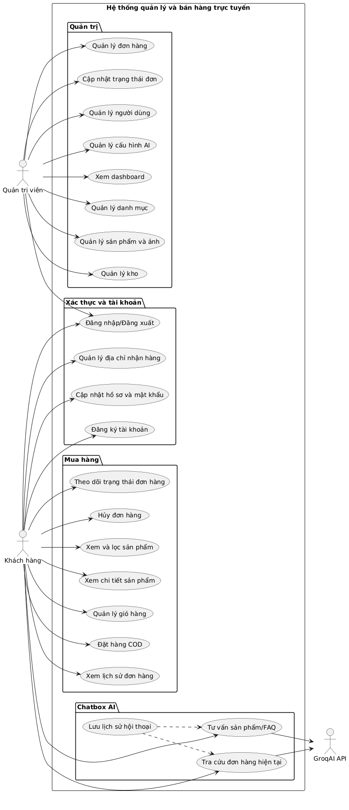

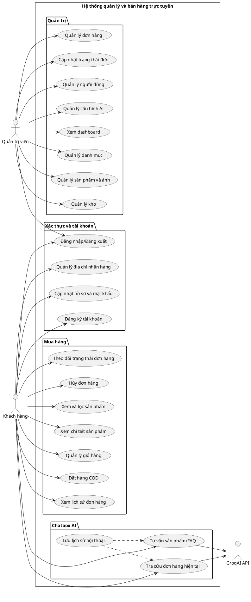
```plantuml
@startuml
left to right direction

actor "Khách hàng" as Customer
actor "Quản trị viên" as Admin
actor "GroqAI API" as Groq

rectangle "Hệ thống quản lý và bán hàng trực tuyến" {
  package "Xác thực và tài khoản" {
    usecase "Đăng ký tài khoản" as UC_Register
    usecase "Đăng nhập/Đăng xuất" as UC_Login
    usecase "Cập nhật hồ sơ và mật khẩu" as UC_Profile
    usecase "Quản lý địa chỉ nhận hàng" as UC_Address
  }

  package "Mua hàng" {
    usecase "Xem và lọc sản phẩm" as UC_ProductList
    usecase "Xem chi tiết sản phẩm" as UC_ProductDetail
    usecase "Quản lý giỏ hàng" as UC_Cart
    usecase "Đặt hàng COD" as UC_Checkout
    usecase "Xem lịch sử đơn hàng" as UC_OrderHistory
    usecase "Theo dõi trạng thái đơn hàng" as UC_TrackOrder
    usecase "Hủy đơn hàng" as UC_CancelOrder
  }

  package "Quản trị" {
    usecase "Xem dashboard" as UC_Dashboard
    usecase "Quản lý danh mục" as UC_Category
    usecase "Quản lý sản phẩm và ảnh" as UC_ProductAdmin
    usecase "Quản lý kho" as UC_Inventory
    usecase "Quản lý đơn hàng" as UC_OrderAdmin
    usecase "Cập nhật trạng thái đơn" as UC_UpdateStatus
    usecase "Quản lý người dùng" as UC_UserAdmin
    usecase "Quản lý cấu hình AI" as UC_AIAdmin
  }

  package "Chatbox AI" {
    usecase "Tư vấn sản phẩm/FAQ" as UC_ChatProduct
    usecase "Tra cứu đơn hàng hiện tại" as UC_ChatOrder
    usecase "Lưu lịch sử hội thoại" as UC_ChatHistory
  }
}

Customer --> UC_Register
Customer --> UC_Login
Customer --> UC_Profile
Customer --> UC_Address
Customer --> UC_ProductList
Customer --> UC_ProductDetail
Customer --> UC_Cart
Customer --> UC_Checkout
Customer --> UC_OrderHistory
Customer --> UC_TrackOrder
Customer --> UC_CancelOrder
Customer --> UC_ChatProduct
Customer --> UC_ChatOrder

Admin --> UC_Login
Admin --> UC_Dashboard
Admin --> UC_Category
Admin --> UC_ProductAdmin
Admin --> UC_Inventory
Admin --> UC_OrderAdmin
Admin --> UC_UpdateStatus
Admin --> UC_UserAdmin
Admin --> UC_AIAdmin

UC_ChatProduct --> Groq
UC_ChatOrder --> Groq
UC_ChatHistory ..> UC_ChatProduct
UC_ChatHistory ..> UC_ChatOrder

@enduml
```

---

# 7. Sequence Diagram

## 7.1. Sequence đăng nhập

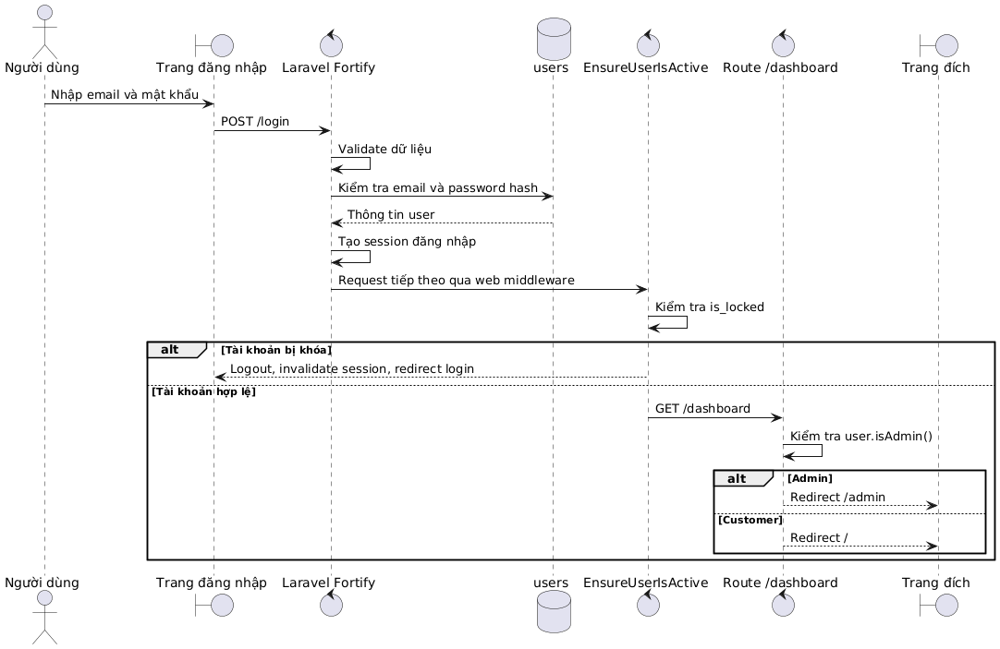

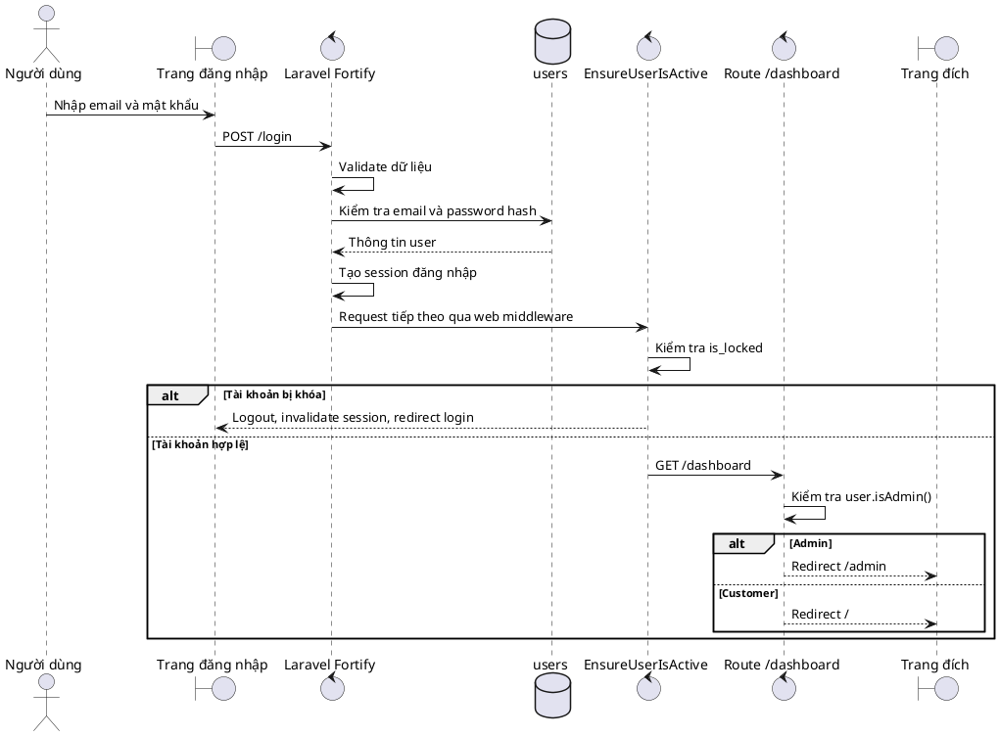
```plantuml
@startuml
actor "Người dùng" as User
boundary "Trang đăng nhập" as LoginView
control "Laravel Fortify" as Fortify
database "users" as Users
control "EnsureUserIsActive" as ActiveMiddleware
control "Route /dashboard" as DashboardRoute
boundary "Trang đích" as Target

User -> LoginView: Nhập email và mật khẩu
LoginView -> Fortify: POST /login
Fortify -> Fortify: Validate dữ liệu
Fortify -> Users: Kiểm tra email và password hash
Users --> Fortify: Thông tin user
Fortify -> Fortify: Tạo session đăng nhập
Fortify -> ActiveMiddleware: Request tiếp theo qua web middleware
ActiveMiddleware -> ActiveMiddleware: Kiểm tra is_locked

alt Tài khoản bị khóa
  ActiveMiddleware --> LoginView: Logout, invalidate session, redirect login
else Tài khoản hợp lệ
  ActiveMiddleware -> DashboardRoute: GET /dashboard
  DashboardRoute -> DashboardRoute: Kiểm tra user.isAdmin()
  alt Admin
    DashboardRoute --> Target: Redirect /admin
  else Customer
    DashboardRoute --> Target: Redirect /
  end
end

@enduml
```

## 7.2. Sequence đặt hàng

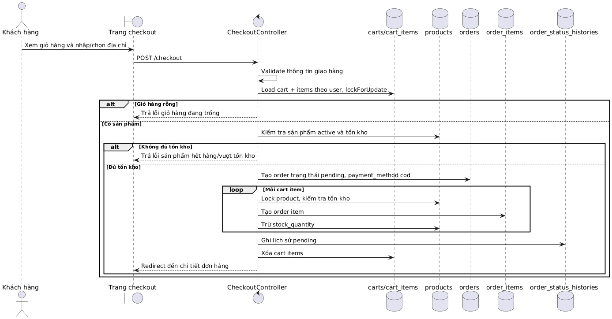

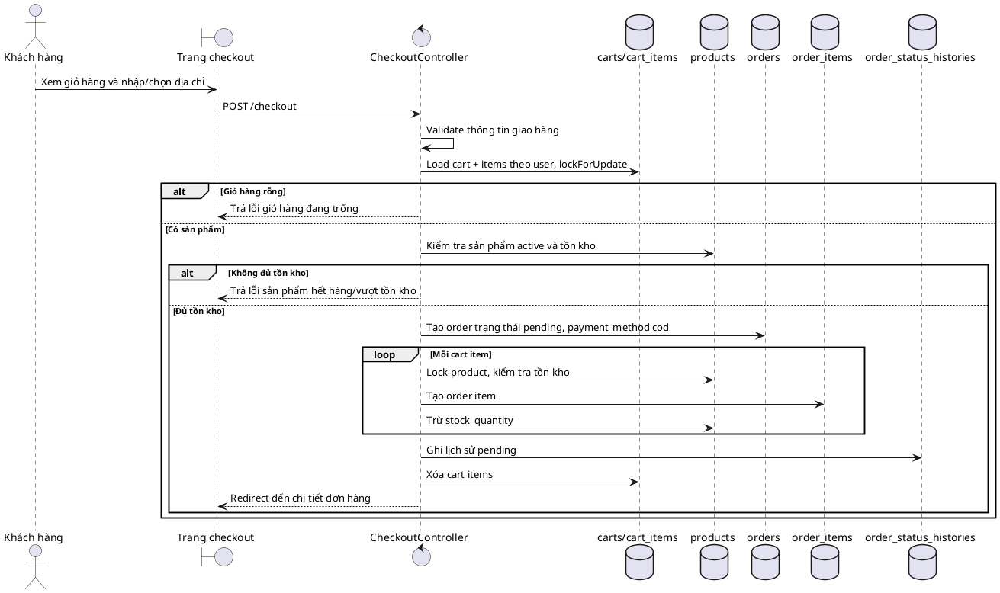
```plantuml
@startuml
actor "Khách hàng" as Customer
boundary "Trang checkout" as CheckoutView
control "CheckoutController" as Checkout
database "carts/cart_items" as CartDB
database "products" as ProductDB
database "orders" as Orders
database "order_items" as OrderItems
database "order_status_histories" as Histories

Customer -> CheckoutView: Xem giỏ hàng và nhập/chọn địa chỉ
CheckoutView -> Checkout: POST /checkout
Checkout -> Checkout: Validate thông tin giao hàng
Checkout -> CartDB: Load cart + items theo user, lockForUpdate

alt Giỏ hàng rỗng
  Checkout --> CheckoutView: Trả lỗi giỏ hàng đang trống
else Có sản phẩm
  Checkout -> ProductDB: Kiểm tra sản phẩm active và tồn kho
  alt Không đủ tồn kho
    Checkout --> CheckoutView: Trả lỗi sản phẩm hết hàng/vượt tồn kho
  else Đủ tồn kho
    Checkout -> Orders: Tạo order trạng thái pending, payment_method cod
    loop Mỗi cart item
      Checkout -> ProductDB: Lock product, kiểm tra tồn kho
      Checkout -> OrderItems: Tạo order item
      Checkout -> ProductDB: Trừ stock_quantity
    end
    Checkout -> Histories: Ghi lịch sử pending
    Checkout -> CartDB: Xóa cart items
    Checkout --> CheckoutView: Redirect đến chi tiết đơn hàng
  end
end

@enduml
```

## 7.3. Sequence quản trị viên cập nhật trạng thái đơn hàng

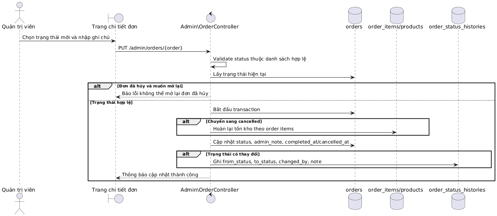

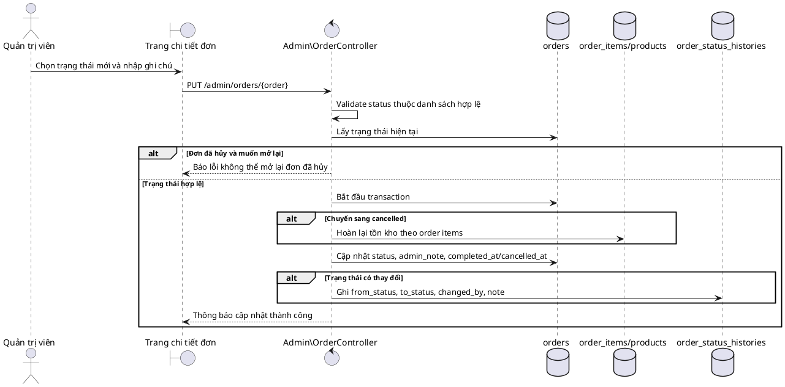
```plantuml
@startuml
actor "Quản trị viên" as Admin
boundary "Trang chi tiết đơn" as OrderView
control "Admin\\OrderController" as OrderController
database "orders" as Orders
database "order_items/products" as Inventory
database "order_status_histories" as Histories

Admin -> OrderView: Chọn trạng thái mới và nhập ghi chú
OrderView -> OrderController: PUT /admin/orders/{order}
OrderController -> OrderController: Validate status thuộc danh sách hợp lệ
OrderController -> Orders: Lấy trạng thái hiện tại

alt Đơn đã hủy và muốn mở lại
  OrderController --> OrderView: Báo lỗi không thể mở lại đơn đã hủy
else Trạng thái hợp lệ
  OrderController -> Orders: Bắt đầu transaction
  alt Chuyển sang cancelled
    OrderController -> Inventory: Hoàn lại tồn kho theo order items
  end
  OrderController -> Orders: Cập nhật status, admin_note, completed_at/cancelled_at
  alt Trạng thái có thay đổi
    OrderController -> Histories: Ghi from_status, to_status, changed_by, note
  end
  OrderController --> OrderView: Thông báo cập nhật thành công
end

@enduml
```

## 7.4. Sequence Chatbox AI

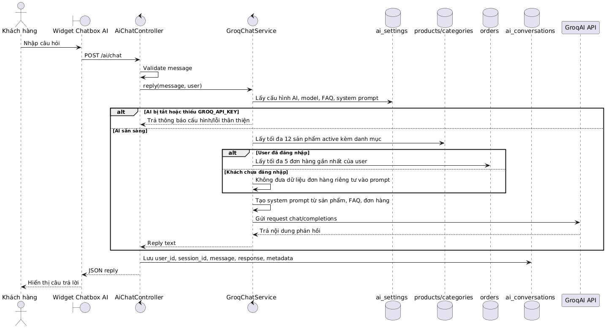

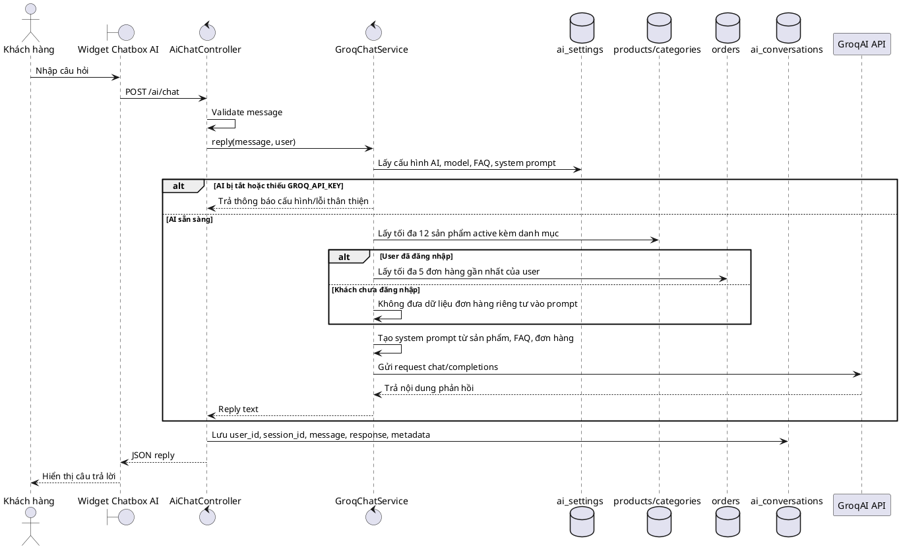
```plantuml
@startuml
actor "Khách hàng" as Customer
boundary "Widget Chatbox AI" as Widget
control "AiChatController" as AiController
control "GroqChatService" as GroqService
database "ai_settings" as Settings
database "products/categories" as Products
database "orders" as Orders
database "ai_conversations" as Conversations
participant "GroqAI API" as Groq

Customer -> Widget: Nhập câu hỏi
Widget -> AiController: POST /ai/chat
AiController -> AiController: Validate message
AiController -> GroqService: reply(message, user)
GroqService -> Settings: Lấy cấu hình AI, model, FAQ, system prompt

alt AI bị tắt hoặc thiếu GROQ_API_KEY
  GroqService --> AiController: Trả thông báo cấu hình/lỗi thân thiện
else AI sẵn sàng
  GroqService -> Products: Lấy tối đa 12 sản phẩm active kèm danh mục
  alt User đã đăng nhập
    GroqService -> Orders: Lấy tối đa 5 đơn hàng gần nhất của user
  else Khách chưa đăng nhập
    GroqService -> GroqService: Không đưa dữ liệu đơn hàng riêng tư vào prompt
  end
  GroqService -> GroqService: Tạo system prompt từ sản phẩm, FAQ, đơn hàng
  GroqService -> Groq: Gửi request chat/completions
  Groq --> GroqService: Trả nội dung phản hồi
  GroqService --> AiController: Reply text
end

AiController -> Conversations: Lưu user_id, session_id, message, response, metadata
AiController --> Widget: JSON reply
Widget --> Customer: Hiển thị câu trả lời

@enduml
```

---

# 8. Activity Diagram

## 8.1. Activity đặt hàng


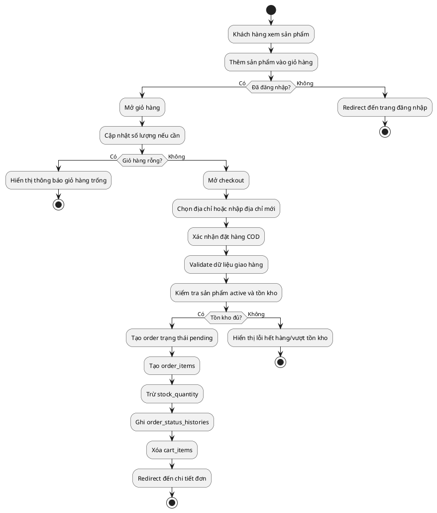
```plantuml
@startuml
start
:Khách hàng xem sản phẩm;
:Thêm sản phẩm vào giỏ hàng;
if (Đã đăng nhập?) then (Có)
  :Mở giỏ hàng;
  :Cập nhật số lượng nếu cần;
  if (Giỏ hàng rỗng?) then (Có)
    :Hiển thị thông báo giỏ hàng trống;
    stop
  else (Không)
    :Mở checkout;
    :Chọn địa chỉ hoặc nhập địa chỉ mới;
    :Xác nhận đặt hàng COD;
    :Validate dữ liệu giao hàng;
    :Kiểm tra sản phẩm active và tồn kho;
    if (Tồn kho đủ?) then (Có)
      :Tạo order trạng thái pending;
      :Tạo order_items;
      :Trừ stock_quantity;
      :Ghi order_status_histories;
      :Xóa cart_items;
      :Redirect đến chi tiết đơn;
      stop
    else (Không)
      :Hiển thị lỗi hết hàng/vượt tồn kho;
      stop
    endif
  endif
else (Không)
  :Redirect đến trang đăng nhập;
  stop
endif
@enduml
```

## 8.2. Activity xử lý đơn hàng của quản trị viên

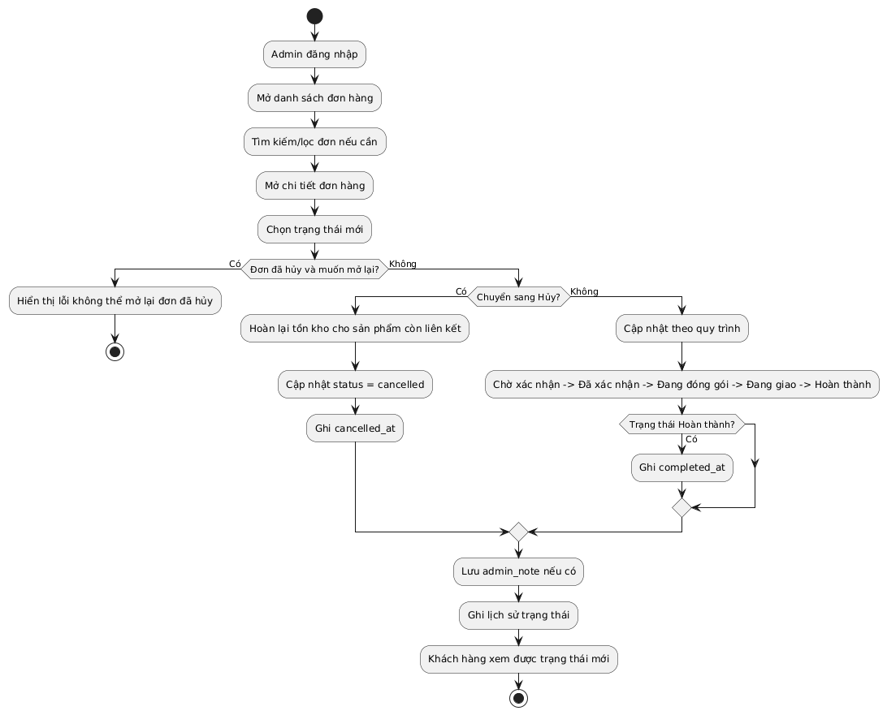

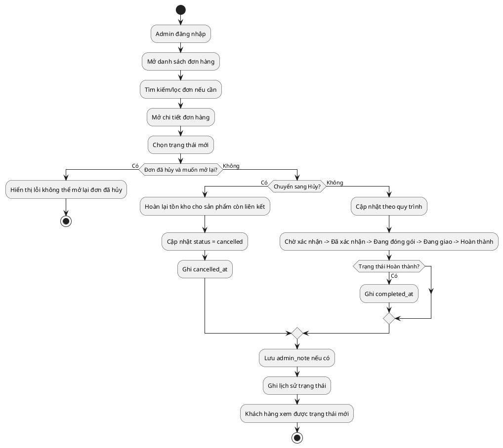
```plantuml
@startuml
start
:Admin đăng nhập;
:Mở danh sách đơn hàng;
:Tìm kiếm/lọc đơn nếu cần;
:Mở chi tiết đơn hàng;
:Chọn trạng thái mới;

if (Đơn đã hủy và muốn mở lại?) then (Có)
  :Hiển thị lỗi không thể mở lại đơn đã hủy;
  stop
else (Không)
  if (Chuyển sang Hủy?) then (Có)
    :Hoàn lại tồn kho cho sản phẩm còn liên kết;
    :Cập nhật status = cancelled;
    :Ghi cancelled_at;
  else (Không)
    :Cập nhật theo quy trình;
    :Chờ xác nhận -> Đã xác nhận -> Đang đóng gói -> Đang giao -> Hoàn thành;
    if (Trạng thái Hoàn thành?) then (Có)
      :Ghi completed_at;
    endif
  endif
  :Lưu admin_note nếu có;
  :Ghi lịch sử trạng thái;
  :Khách hàng xem được trạng thái mới;
  stop
endif
@enduml
```

## 8.3. Activity Chatbox AI

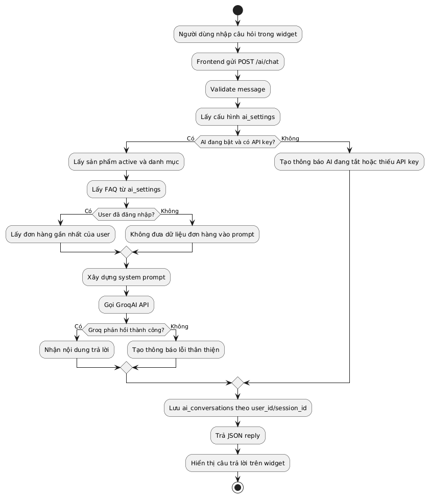

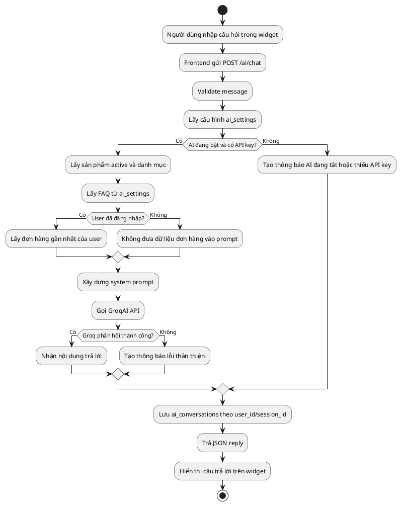
```plantuml
@startuml
start
:Người dùng nhập câu hỏi trong widget;
:Frontend gửi POST /ai/chat;
:Validate message;
:Lấy cấu hình ai_settings;
if (AI đang bật và có API key?) then (Có)
  :Lấy sản phẩm active và danh mục;
  :Lấy FAQ từ ai_settings;
  if (User đã đăng nhập?) then (Có)
    :Lấy đơn hàng gần nhất của user;
  else (Không)
    :Không đưa dữ liệu đơn hàng vào prompt;
  endif
  :Xây dựng system prompt;
  :Gọi GroqAI API;
  if (Groq phản hồi thành công?) then (Có)
    :Nhận nội dung trả lời;
  else (Không)
    :Tạo thông báo lỗi thân thiện;
  endif
else (Không)
  :Tạo thông báo AI đang tắt hoặc thiếu API key;
endif
:Lưu ai_conversations theo user_id/session_id;
:Trả JSON reply;
:Hiển thị câu trả lời trên widget;
stop
@enduml
```

---

# 9. Phân tích cơ sở dữ liệu

## 9.1. Tổng quan database

Cơ sở dữ liệu được tạo bằng các migration trong `database/migrations`. Hệ thống có hai nhóm bảng:

- Bảng nền tảng Laravel/Fortify: `users`, `password_reset_tokens`, `sessions`, `cache`, `cache_locks`, `jobs`, `job_batches`, `failed_jobs`. Bảng `passkeys` và các cột 2FA trên `users` là schema kế thừa từ starter kit, hiện không được bật trong cấu hình xác thực.
- Bảng nghiệp vụ bán hàng: `roles`, `user_addresses`, `categories`, `products`, `product_images`, `carts`, `cart_items`, `orders`, `order_items`, `order_status_histories`, `ai_settings`, `ai_conversations`.

## 9.2. Danh sách bảng và ý nghĩa

| Bảng | Ý nghĩa | Khóa chính | Khóa ngoại/quan hệ chính |
| --- | --- | --- | --- |
| `users` | Lưu tài khoản người dùng, thông tin xác thực và trạng thái khóa. | `id` | `role_id` tham chiếu `roles.id`. |
| `roles` | Lưu vai trò nghiệp vụ `admin`, `customer`. | `id` | Một role có nhiều users. |
| `user_addresses` | Lưu địa chỉ nhận hàng của khách hàng. | `id` | `user_id` tham chiếu `users.id`. |
| `categories` | Lưu danh mục sản phẩm. | `id` | Một danh mục có nhiều sản phẩm. |
| `products` | Lưu thông tin sản phẩm, giá, SKU, tồn kho. | `id` | `category_id` tham chiếu `categories.id`. |
| `product_images` | Lưu ảnh sản phẩm, ảnh đại diện và thứ tự. | `id` | `product_id` tham chiếu `products.id`. |
| `carts` | Lưu giỏ hàng của user. | `id` | `user_id` tham chiếu `users.id`, unique. |
| `cart_items` | Lưu từng sản phẩm trong giỏ hàng. | `id` | `cart_id` tham chiếu `carts.id`, `product_id` tham chiếu `products.id`. |
| `orders` | Lưu đơn hàng COD, trạng thái, người nhận và tổng tiền. | `id` | `user_id` tham chiếu `users.id`. |
| `order_items` | Lưu chi tiết sản phẩm trong đơn hàng. | `id` | `order_id` tham chiếu `orders.id`, `product_id` nullable tham chiếu `products.id`. |
| `order_status_histories` | Lưu lịch sử thay đổi trạng thái đơn hàng. | `id` | `order_id` tham chiếu `orders.id`, `changed_by` tham chiếu `users.id`. |
| `ai_settings` | Lưu cấu hình Chatbox AI: bật/tắt, model, prompt, FAQ. | `id` | Không có khóa ngoại. |
| `ai_conversations` | Lưu lịch sử chat AI. | `id` | `user_id` nullable tham chiếu `users.id`, có `session_id` cho guest/session. |
| `password_reset_tokens` | Lưu token đặt lại mật khẩu của Fortify. | `email` | Không có khóa ngoại. |
| `sessions` | Lưu session khi `SESSION_DRIVER=database`. | `id` | `user_id` nullable, index. |
| `cache` | Lưu cache database. | `key` | Không có khóa ngoại. |
| `cache_locks` | Lưu khóa cache lock. | `key` | Không có khóa ngoại. |
| `jobs` | Lưu job queue. | `id` | Không có khóa ngoại. |
| `job_batches` | Lưu batch job. | `id` | Không có khóa ngoại. |
| `failed_jobs` | Lưu job thất bại. | `id` | Không có khóa ngoại. |
| `passkeys` | Schema kế thừa từ Fortify starter kit; hiện không dùng trong luồng đăng nhập. | `id` | `user_id` tham chiếu `users.id`. |

## 9.3. Các trường quan trọng

### Bảng `users`

| Trường | Ý nghĩa |
| --- | --- |
| `id` | Khóa chính. |
| `role_id` | Vai trò người dùng, nullable, liên kết `roles`. |
| `name` | Tên người dùng. |
| `email` | Email đăng nhập, unique. |
| `phone` | Số điện thoại. |
| `password` | Mật khẩu đã hash. |
| `is_locked` | Tài khoản có bị khóa hay không. |
| `two_factor_secret`, `two_factor_recovery_codes`, `two_factor_confirmed_at` | Cột kế thừa từ Fortify starter kit; tính năng 2FA hiện không bật. |

### Bảng `products`

| Trường | Ý nghĩa |
| --- | --- |
| `category_id` | Danh mục của sản phẩm. |
| `name`, `slug`, `sku` | Tên, slug URL và mã SKU. |
| `description` | Mô tả sản phẩm. |
| `price` | Giá bán. |
| `stock_quantity` | Số lượng tồn kho. |
| `low_stock_threshold` | Ngưỡng cảnh báo sắp hết hàng. |
| `is_active` | Sản phẩm có hiển thị trên storefront hay không. |

### Bảng `orders`

| Trường | Ý nghĩa |
| --- | --- |
| `order_code` | Mã đơn hàng unique. |
| `status` | Trạng thái: `pending`, `confirmed`, `packing`, `shipping`, `completed`, `cancelled`. |
| `payment_method` | Hiện tại mặc định là `cod`. |
| `recipient_name`, `recipient_phone`, `shipping_address` | Thông tin giao hàng tại thời điểm đặt hàng. |
| `subtotal`, `total_amount` | Tổng tiền đơn hàng. |
| `customer_note`, `admin_note` | Ghi chú khách hàng và quản trị viên. |
| `completed_at`, `cancelled_at` | Thời điểm hoàn thành hoặc hủy. |

### Bảng `ai_conversations`

| Trường | Ý nghĩa |
| --- | --- |
| `user_id` | Người dùng đã đăng nhập, nullable cho khách chưa đăng nhập. |
| `session_id` | Mã session để lưu lịch sử chat theo phiên, kể cả guest. |
| `message` | Câu hỏi của người dùng. |
| `response` | Câu trả lời AI. |
| `metadata` | Thông tin phụ như IP, user agent. |

## 9.4. Quan hệ dữ liệu chính

- `roles` 1-n `users`.
- `users` 1-n `user_addresses`.
- `users` 1-1 `carts`.
- `carts` 1-n `cart_items`.
- `products` 1-n `cart_items`.
- `categories` 1-n `products`.
- `products` 1-n `product_images`.
- `users` 1-n `orders`.
- `orders` 1-n `order_items`.
- `products` 1-n `order_items` nhưng `product_id` nullable để giữ lịch sử nếu sản phẩm bị xóa.
- `orders` 1-n `order_status_histories`.
- `users` 1-n `order_status_histories` qua `changed_by`.
- `users` 1-n `ai_conversations`, đồng thời `ai_conversations.session_id` hỗ trợ guest/session.

---

# 10. ERD bằng PlantUML

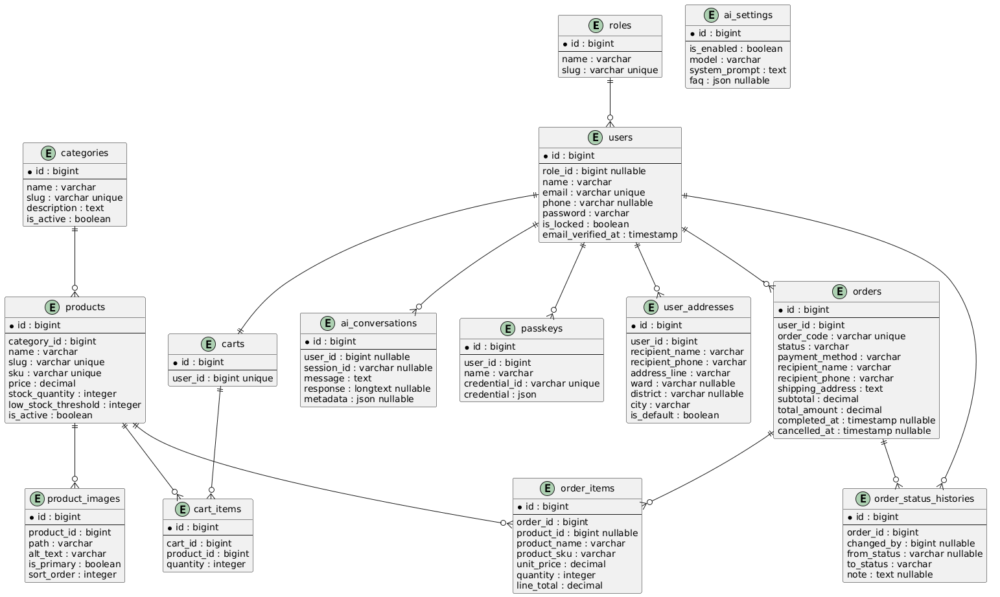

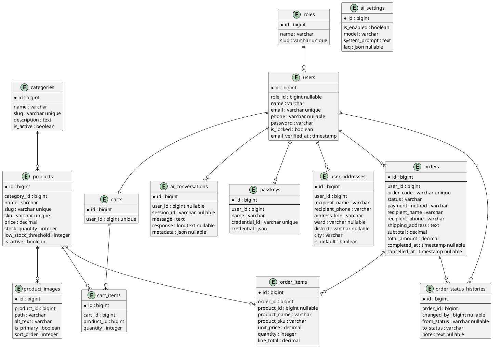
```plantuml
@startuml

entity roles {
  * id : bigint
  --
  name : varchar
  slug : varchar unique
}

entity users {
  * id : bigint
  --
  role_id : bigint nullable
  name : varchar
  email : varchar unique
  phone : varchar nullable
  password : varchar
  is_locked : boolean
  email_verified_at : timestamp
}

entity user_addresses {
  * id : bigint
  --
  user_id : bigint
  recipient_name : varchar
  recipient_phone : varchar
  address_line : varchar
  ward : varchar nullable
  district : varchar nullable
  city : varchar
  is_default : boolean
}

entity categories {
  * id : bigint
  --
  name : varchar
  slug : varchar unique
  description : text
  is_active : boolean
}

entity products {
  * id : bigint
  --
  category_id : bigint
  name : varchar
  slug : varchar unique
  sku : varchar unique
  price : decimal
  stock_quantity : integer
  low_stock_threshold : integer
  is_active : boolean
}

entity product_images {
  * id : bigint
  --
  product_id : bigint
  path : varchar
  alt_text : varchar
  is_primary : boolean
  sort_order : integer
}

entity carts {
  * id : bigint
  --
  user_id : bigint unique
}

entity cart_items {
  * id : bigint
  --
  cart_id : bigint
  product_id : bigint
  quantity : integer
}

entity orders {
  * id : bigint
  --
  user_id : bigint
  order_code : varchar unique
  status : varchar
  payment_method : varchar
  recipient_name : varchar
  recipient_phone : varchar
  shipping_address : text
  subtotal : decimal
  total_amount : decimal
  completed_at : timestamp nullable
  cancelled_at : timestamp nullable
}

entity order_items {
  * id : bigint
  --
  order_id : bigint
  product_id : bigint nullable
  product_name : varchar
  product_sku : varchar
  unit_price : decimal
  quantity : integer
  line_total : decimal
}

entity order_status_histories {
  * id : bigint
  --
  order_id : bigint
  changed_by : bigint nullable
  from_status : varchar nullable
  to_status : varchar
  note : text nullable
}

entity ai_settings {
  * id : bigint
  --
  is_enabled : boolean
  model : varchar
  system_prompt : text
  faq : json nullable
}

entity ai_conversations {
  * id : bigint
  --
  user_id : bigint nullable
  session_id : varchar nullable
  message : text
  response : longtext nullable
  metadata : json nullable
}

entity passkeys {
  * id : bigint
  --
  user_id : bigint
  name : varchar
  credential_id : varchar unique
  credential : json
}

roles ||--o{ users
users ||--o{ user_addresses
users ||--|| carts
carts ||--o{ cart_items
products ||--o{ cart_items
categories ||--o{ products
products ||--o{ product_images
users ||--o{ orders
orders ||--o{ order_items
products ||--o{ order_items
orders ||--o{ order_status_histories
users ||--o{ order_status_histories
users ||--o{ ai_conversations
users ||--o{ passkeys

@enduml
```

---

# 11. Mô tả kiến trúc hệ thống

## 11.1. Kiến trúc MVC trong Laravel

Hệ thống được tổ chức theo kiến trúc MVC của Laravel:

- **Model** đại diện dữ liệu và quan hệ database.
- **View** hiển thị giao diện bằng Blade, Tailwind CSS, Flux UI và một số page component Livewire từ starter kit.
- **Controller** tiếp nhận request, validate dữ liệu, gọi model/service và trả view/response.

## 11.2. Vai trò của Model

Thư mục `app/Models` chứa các model chính:

- `User`, `Role`, `UserAddress`: quản lý tài khoản, vai trò và địa chỉ.
- `Category`, `Product`, `ProductImage`: quản lý danh mục, sản phẩm và hình ảnh.
- `Cart`, `CartItem`: quản lý giỏ hàng.
- `Order`, `OrderItem`, `OrderStatusHistory`: quản lý đơn hàng, chi tiết đơn và lịch sử trạng thái.
- `AiSetting`, `AiConversation`: cấu hình và lưu lịch sử Chatbox AI.

Các model định nghĩa quan hệ Eloquent như `belongsTo`, `hasMany`, `hasOne`, cast dữ liệu và helper như `Product::isInStock()`, `Product::imageUrl()`, `Order::statuses()`.

## 11.3. Vai trò của View Blade/Livewire

Thư mục `resources/views` chứa giao diện chính:

- `layouts/store.blade.php`: layout khách hàng, header, footer, Chatbox AI.
- `store/index.blade.php`, `store/show.blade.php`: danh sách và chi tiết sản phẩm.
- `customer/cart.blade.php`, `customer/checkout.blade.php`, `customer/orders/*`, `customer/addresses.blade.php`: giỏ hàng, đặt hàng, đơn hàng và địa chỉ.
- `admin/*`: các màn quản trị dashboard, danh mục, sản phẩm, kho, đơn hàng, người dùng, AI.
- `pages/auth/*`, `pages/settings/*`: giao diện xác thực và settings từ Laravel Livewire starter kit.

Livewire được sử dụng trong các trang settings qua `Route::livewire` trong `routes/settings.php` và các page components của starter kit. Phần nghiệp vụ bán hàng hiện tại chủ yếu dùng controller Laravel và Blade.

## 11.4. Vai trò của Controller

Các controller nghiệp vụ nằm trong `app/Http/Controllers`:

- `StorefrontController`: trang chủ, danh sách, lọc và chi tiết sản phẩm.
- `CartController`: thêm, cập nhật, xóa sản phẩm trong giỏ.
- `CheckoutController`: checkout COD, transaction tạo đơn và trừ kho.
- `CustomerOrderController`: lịch sử, chi tiết, hủy đơn của khách hàng.
- `AddressController`: quản lý địa chỉ nhận hàng.
- `AiChatController`: endpoint chat AI.
- Nhóm `Admin/*`: dashboard, danh mục, sản phẩm, kho, đơn hàng, người dùng, AI.

## 11.5. Vai trò của Route

`routes/web.php` định nghĩa:

- Route công khai: `/`, `/products/{product:slug}`, `/ai/chat`.
- Route yêu cầu đăng nhập: `/cart`, `/checkout`, `/orders`, `/addresses`.
- Route dashboard điều hướng theo vai trò.
- Route quản trị `/admin/*` có middleware `auth`, `verified`, `admin`.
- `routes/settings.php` định nghĩa các route Livewire cho settings.

## 11.6. Vai trò của Migration

Migration tạo toàn bộ schema database. Các migration gốc của Laravel tạo `users`, `sessions`, `cache`, `jobs`, `passkeys`, cột 2FA, nhưng cấu hình Fortify hiện tại không bật passkey hoặc 2FA. Migration nghiệp vụ `2026_06_07_130000_create_shop_tables.php` tạo các bảng bán hàng. Migration `2026_06_07_140000_add_session_id_to_ai_conversations_table.php` bổ sung lưu lịch sử chat theo session.

## 11.7. Vai trò của Middleware

Hệ thống có middleware:

- `EnsureUserIsAdmin`: kiểm tra user có role `admin` trước khi vào `/admin/*`.
- `EnsureUserIsActive`: nếu user bị khóa, hệ thống logout, invalidate session và chuyển về login.

Hai middleware được đăng ký trong `bootstrap/app.php`.

## 11.8. Vai trò của Service

`app/Services/GroqChatService.php` chịu trách nhiệm:

- Kiểm tra AI đang bật hay tắt.
- Kiểm tra `GROQ_API_KEY`.
- Lấy sản phẩm active, FAQ và đơn hàng của user hiện tại.
- Xây dựng prompt cho AI.
- Gọi GroqAI API.
- Trả phản hồi hoặc thông báo lỗi thân thiện.

Việc tách logic AI vào service giúp controller gọn hơn và dễ bảo trì.

---

# 12. Cách training và hoạt động của Chatbox AI

## 12.1. Mục tiêu của Chatbox AI

Chatbox AI được xây dựng nhằm hỗ trợ khách hàng trong quá trình mua sắm. AI có thể tư vấn sản phẩm, trả lời câu hỏi thường gặp, hướng dẫn sử dụng website và hỗ trợ tra cứu đơn hàng của người dùng đang đăng nhập.

## 12.2. Nguồn dữ liệu Chatbox AI sử dụng

Trong source code hiện tại, Chatbox AI sử dụng các nguồn dữ liệu:

- `ai_settings.system_prompt`: nội dung hướng dẫn chung cho AI.
- `ai_settings.faq`: danh sách câu hỏi thường gặp và câu trả lời.
- `products` và `categories`: tối đa 12 sản phẩm active mới nhất, gồm tên, SKU, danh mục, giá, tồn kho và mô tả ngắn.
- `orders`: tối đa 5 đơn hàng gần nhất của người dùng đang đăng nhập.
- Nội dung câu hỏi hiện tại từ người dùng.

Đối với khách chưa đăng nhập, hệ thống không đưa dữ liệu đơn hàng riêng tư vào prompt.

## 12.3. Cách hệ thống xây dựng prompt

Hệ thống không huấn luyện lại mô hình AI từ đầu. Thay vào đó, `GroqChatService` xây dựng prompt ngữ cảnh gồm:

- System prompt do admin cấu hình.
- Quy tắc trả lời bằng tiếng Việt, không bịa sản phẩm hoặc đơn hàng.
- Danh sách sản phẩm đang có.
- FAQ đã cấu hình.
- Danh sách đơn hàng của user hiện tại nếu đã đăng nhập.

Prompt này được gửi cùng câu hỏi của người dùng tới GroqAI API. Cách làm này thuộc hướng prompt engineering, không phải fine-tuning hay training model.

## 12.4. Quy trình gọi GroqAI API

Quy trình gọi API:

1. `AiChatController@store` nhận request `POST /ai/chat`.
2. Controller validate `message` tối đa 1200 ký tự.
3. Controller gọi `GroqChatService::reply($message, $request->user())`.
4. Service lấy API key từ `config('services.groq.key')`.
5. Service gửi request tới endpoint `chat/completions` của Groq.
6. Service nhận nội dung phản hồi tại `choices.0.message.content`.
7. Nếu request không thành công, service trả thông báo lỗi thân thiện.

## 12.5. Cách lưu lịch sử hội thoại

Sau khi nhận phản hồi, `AiChatController` lưu hội thoại vào `ai_conversations` với các trường:

- `user_id`: ID người dùng nếu đã đăng nhập.
- `session_id`: ID session hiện tại, giúp lưu lịch sử cho cả khách chưa đăng nhập.
- `message`: câu hỏi.
- `response`: câu trả lời.
- `metadata`: IP và user agent.

Layout `resources/views/layouts/store.blade.php` preload 20 hội thoại gần nhất theo `session_id`. Vì vậy khi người dùng reload trang hoặc chuyển tab trong cùng session, lịch sử chat vẫn được hiển thị lại.

## 12.6. Cách bảo mật API key

API key không được hard-code trong source code. File `config/services.php` đọc:

```php
'groq' => [
    'key' => env('GROQ_API_KEY'),
    'model' => env('GROQ_MODEL', 'llama-3.1-8b-instant'),
    'base_url' => env('GROQ_BASE_URL', 'https://api.groq.com/openai/v1'),
    'timeout' => (int) env('GROQ_TIMEOUT', 20),
],
```

Khi triển khai, API key được cấu hình trong `.env`:

```env
GROQ_API_KEY=...
GROQ_MODEL=llama-3.1-8b-instant
AI_CHAT_ENABLED=true
```

## 12.7. Hạn chế và hướng phát triển

Hạn chế hiện tại:

- AI chỉ sử dụng ngữ cảnh ngắn từ tối đa 12 sản phẩm active và 5 đơn hàng gần nhất.
- Chưa có cơ chế tìm kiếm ngữ nghĩa hoặc RAG nâng cao.
- Chưa có phân loại chủ đề câu hỏi.
- Chưa có bộ lọc nội dung đầu ra chuyên sâu.

Hướng phát triển:

- Tối ưu prompt theo từng loại câu hỏi.
- Bổ sung dữ liệu chính sách giao hàng, đổi trả, bảo hành.
- Xây dựng cơ chế tìm kiếm sản phẩm liên quan trước khi đưa vào prompt.
- Thêm dashboard thống kê hiệu quả Chatbox AI.

---

# 13. Cài đặt hệ thống

## 13.1. Yêu cầu môi trường

- PHP phù hợp với `composer.json` của dự án.
- Composer.
- Node.js và npm.
- MySQL.
- Tài khoản GroqAI và `GROQ_API_KEY` nếu muốn dùng Chatbox AI.

## 13.2. Cài đặt thư viện

```bash
composer install
npm install
```

## 13.3. Cấu hình môi trường

```bash
cp .env.example .env
php artisan key:generate
```

Cấu hình MySQL trong `.env`:

```env
DB_CONNECTION=mysql
DB_HOST=127.0.0.1
DB_PORT=3306
DB_DATABASE=dacs_cntt
DB_USERNAME=root
DB_PASSWORD=
```

Cấu hình GroqAI:

```env
GROQ_API_KEY=your_groq_api_key
GROQ_MODEL=llama-3.1-8b-instant
GROQ_BASE_URL=https://api.groq.com/openai/v1
GROQ_TIMEOUT=20
AI_CHAT_ENABLED=true
```

## 13.4. Tạo database và dữ liệu mẫu

```bash
php artisan migrate
php artisan db:seed
php artisan storage:link
```

Dữ liệu mẫu tạo:

- Admin: `admin@example.com` / `password`
- Khách hàng: `customer@example.com` / `password`
- Danh mục, sản phẩm, ảnh sản phẩm, tồn kho, đơn hàng demo và cấu hình AI mặc định.

## 13.5. Chạy hệ thống

Chạy Laravel:

```bash
php artisan serve
```

Chạy Vite khi phát triển:

```bash
npm run dev
```

Build production:

```bash
npm run build
```

Project có cấu hình queue và bảng `jobs`. Nghiệp vụ bán hàng hiện tại chưa bắt buộc queue, nhưng có thể chạy queue worker khi cần:

```bash
php artisan queue:work
```

---

# 14. Hướng dẫn demo giao diện chính

## 14.1. Demo phía khách hàng

1. Mở trang chủ `/`.
2. Quan sát danh sách sản phẩm, ảnh, giá, danh mục và trạng thái còn hàng/hết hàng.
3. Tìm kiếm sản phẩm theo tên.
4. Lọc theo danh mục và khoảng giá.
5. Mở chi tiết sản phẩm.
6. Đăng nhập khách hàng `customer@example.com` / `password`.
7. Thêm sản phẩm vào giỏ hàng.
8. Mở `/cart`, cập nhật số lượng hoặc xóa sản phẩm.
9. Mở `/checkout`, chọn địa chỉ có sẵn hoặc nhập địa chỉ mới.
10. Xác nhận đặt hàng COD.
11. Mở `/orders`, xem lịch sử đơn hàng.
12. Mở chi tiết đơn để xem timeline trạng thái.
13. Hỏi Chatbox AI về sản phẩm hoặc đơn hàng.

## 14.2. Demo phía quản trị viên

1. Đăng nhập admin `admin@example.com` / `password`.
2. Vào `/admin` để xem dashboard.
3. Mở quản lý danh mục, thêm/sửa danh mục.
4. Mở quản lý sản phẩm, thêm/sửa sản phẩm, upload ảnh hoặc nhập URL ảnh.
5. Mở quản lý kho, cập nhật số lượng tồn và ngưỡng sắp hết hàng.
6. Mở danh sách đơn hàng, tìm kiếm hoặc lọc theo trạng thái.
7. Mở chi tiết đơn hàng, cập nhật trạng thái và ghi chú xử lý.
8. Mở quản lý người dùng, đổi role hoặc khóa/mở khóa tài khoản.
9. Mở quản lý AI, bật/tắt AI, cập nhật prompt/FAQ và xem lịch sử hội thoại.

## 14.3. Demo luồng hoàn chỉnh

Luồng demo tổng quát:

```txt
Khách hàng đăng nhập -> Xem sản phẩm -> Thêm vào giỏ -> Đặt hàng COD
-> Admin đăng nhập -> Xem đơn hàng mới -> Cập nhật trạng thái
-> Khách hàng quay lại chi tiết đơn -> Theo dõi timeline trạng thái mới
```

---

# 15. Giao diện chính của hệ thống

## 15.1. Trang chủ và danh sách sản phẩm

File view: `resources/views/store/index.blade.php`.

Giao diện hiển thị danh sách sản phẩm dạng card, có ảnh, tên, danh mục, giá và trạng thái còn hàng/hết hàng. Người dùng có thể tìm kiếm theo tên, lọc theo danh mục và khoảng giá.


## 15.2. Trang chi tiết sản phẩm

File view: `resources/views/store/show.blade.php`.

Trang hiển thị ảnh sản phẩm, thông tin danh mục, SKU, giá, tồn kho, mô tả, form chọn số lượng và nút thêm vào giỏ hàng. Nếu có sản phẩm cùng danh mục, hệ thống hiển thị danh sách sản phẩm liên quan.


## 15.3. Trang giỏ hàng

File view: `resources/views/customer/cart.blade.php`.

Giao diện hiển thị các sản phẩm trong giỏ, số lượng, tồn kho, đơn giá, nút cập nhật và nút xóa. Bên phải có phần tạm tính và nút đi tới checkout.


## 15.4. Trang đặt hàng

File view: `resources/views/customer/checkout.blade.php`.

Trang checkout cho phép khách hàng chọn địa chỉ đã lưu hoặc nhập địa chỉ mới, nhập ghi chú giao hàng và xem lại danh sách sản phẩm trước khi xác nhận COD.


## 15.5. Trang lịch sử đơn hàng

File view: `resources/views/customer/orders/index.blade.php`.

Giao diện hiển thị các đơn hàng của khách hàng, gồm mã đơn, ngày đặt, số sản phẩm, tổng tiền và trạng thái.


## 15.6. Trang theo dõi đơn hàng

File view: `resources/views/customer/orders/show.blade.php`.

Trang chi tiết đơn hàng hiển thị danh sách sản phẩm, thông tin giao hàng, tổng tiền, trạng thái hiện tại và timeline lịch sử trạng thái.


## 15.7. Trang đăng nhập/đăng ký

File view: `resources/views/pages/auth/login.blade.php`, `resources/views/pages/auth/register.blade.php`.

Giao diện xác thực được cung cấp bởi Laravel Fortify starter kit, hỗ trợ đăng nhập, đăng ký, quên mật khẩu và xác thực email.


## 15.8. Trang dashboard quản trị

File view: `resources/views/admin/dashboard.blade.php`.

Dashboard hiển thị tổng sản phẩm, tổng đơn hàng, tổng người dùng, doanh thu, đơn hàng mới nhất, sản phẩm sắp hết hàng, đơn hàng theo trạng thái, doanh thu 7 ngày và sản phẩm bán chạy.


## 15.9. Trang quản lý sản phẩm

File view: `resources/views/admin/products/index.blade.php`, `resources/views/admin/products/form.blade.php`.

Admin có thể tìm kiếm, lọc, thêm, sửa, xóa sản phẩm, upload ảnh, thêm URL ảnh và chọn ảnh đại diện.


## 15.10. Trang quản lý danh mục

File view: `resources/views/admin/categories/index.blade.php`, `resources/views/admin/categories/form.blade.php`.

Admin có thể xem danh mục, tìm kiếm, thêm, sửa, bật/tắt và xóa danh mục nếu không có sản phẩm liên quan.


## 15.11. Trang quản lý kho

File view: `resources/views/admin/inventory/index.blade.php`.

Admin có thể lọc sản phẩm sắp hết hàng/hết hàng, cập nhật tồn kho và ngưỡng cảnh báo.


## 15.12. Trang quản lý đơn hàng

File view: `resources/views/admin/orders/index.blade.php`, `resources/views/admin/orders/show.blade.php`.

Admin có thể tìm kiếm, lọc đơn hàng, xem chi tiết, cập nhật trạng thái, ghi chú xử lý và xem lịch sử trạng thái.


## 15.13. Trang quản lý người dùng

File view: `resources/views/admin/users/index.blade.php`.

Admin có thể tìm kiếm user, cập nhật thông tin, đổi vai trò và khóa/mở khóa tài khoản.


## 15.14. Giao diện Chatbox AI

File view: `resources/views/layouts/store.blade.php`, controller `AiChatController`, service `GroqChatService`.

Chatbox AI hiển thị cố định ở góc dưới bên phải giao diện khách hàng. Người dùng nhập câu hỏi, hệ thống gửi request tới `/ai/chat`, nhận phản hồi và hiển thị lịch sử hội thoại. Lịch sử được lưu theo session nên reload hoặc chuyển tab vẫn còn hội thoại cũ trong cùng phiên.


---

# 16. Đánh giá kết quả đạt được

## 16.1. Chức năng đã hoàn thành

- Xác thực người dùng với Laravel Fortify.
- Phân quyền admin/customer bằng bảng `roles` và middleware.
- Khóa/mở khóa tài khoản.
- Quản lý địa chỉ nhận hàng.
- Xem, tìm kiếm, lọc danh sách sản phẩm.
- Xem chi tiết sản phẩm và sản phẩm liên quan.
- Quản lý giỏ hàng.
- Đặt hàng COD có kiểm tra tồn kho, tạo đơn, tạo chi tiết đơn và trừ kho.
- Theo dõi lịch sử đơn hàng và timeline trạng thái.
- Hủy đơn hàng ở trạng thái cho phép.
- Dashboard quản trị.
- CRUD danh mục và sản phẩm.
- Quản lý ảnh sản phẩm.
- Quản lý kho hàng.
- Quản lý đơn hàng và cập nhật trạng thái.
- Ghi lịch sử trạng thái đơn hàng.
- Quản lý người dùng.
- Tích hợp Chatbox AI với GroqAI API.
- Lưu lịch sử hội thoại AI theo user/session.

## 16.2. Chức năng còn hạn chế

- Chưa có thanh toán online. Hệ thống hiện dùng COD.
- Chưa có mã giảm giá.
- Chưa có đánh giá sản phẩm, bình luận hoặc wishlist.
- Chưa có tích hợp đơn vị vận chuyển.
- Chatbox AI dùng prompt ngữ cảnh ngắn, chưa có cơ chế tìm kiếm ngữ nghĩa hoặc RAG nâng cao.
- Chưa có API riêng cho ứng dụng mobile.

## 16.3. Những vấn đề gặp phải và cách khắc phục

| Vấn đề | Cách khắc phục trong hệ thống |
| --- | --- |
| Phân biệt khách hàng và admin | Dùng bảng `roles`, quan hệ `users.role_id`, helper `isAdmin()` và middleware `admin`. |
| Không cho user bị khóa tiếp tục truy cập | Middleware `EnsureUserIsActive` logout và invalidate session khi `is_locked = true`. |
| Đặt hàng vượt tồn kho | `CheckoutController` kiểm tra tồn kho trong transaction và dùng `lockForUpdate`. |
| Lưu trạng thái đơn hàng minh bạch | Bảng `order_status_histories` lưu `from_status`, `to_status`, người thay đổi và ghi chú. |
| Bảo mật API key AI | Đọc `GROQ_API_KEY` từ `.env` qua `config/services.php`. |
| Chat bị mất khi reload | Bổ sung `session_id` vào `ai_conversations` và preload lịch sử theo session trong layout. |

## 16.4. Mức độ đáp ứng yêu cầu đề tài

Hệ thống đáp ứng các yêu cầu chính của đề tài: có phân hệ khách hàng, phân hệ quản trị, quản lý sản phẩm, danh mục, kho hàng, giỏ hàng, đơn hàng, trạng thái đơn, người dùng, dashboard thống kê và Chatbox AI. Các chức năng ngoài phạm vi như thanh toán online, mã giảm giá, đánh giá, bình luận và wishlist chưa triển khai và được xác định là hướng phát triển.

---

# 17. Hướng phát triển

Các hướng phát triển tiếp theo:

- Tích hợp thanh toán online qua VNPay, MoMo, ZaloPay hoặc Stripe.
- Gửi email thông báo khi đặt hàng hoặc khi trạng thái đơn thay đổi.
- Thêm mã giảm giá và chương trình khuyến mãi.
- Thêm đánh giá sản phẩm và bình luận.
- Thêm danh sách yêu thích.
- Tích hợp đơn vị vận chuyển và mã vận đơn.
- Xây dựng API cho ứng dụng mobile.
- Bổ sung notification realtime bằng Laravel Echo hoặc WebSocket.
- Tối ưu Chatbox AI bằng RAG, tìm kiếm ngữ nghĩa và nguồn dữ liệu sản phẩm chi tiết hơn.
- Tăng cường thống kê doanh thu theo tháng/quý/năm và xuất báo cáo.
- Bổ sung kiểm thử tự động cho các luồng nghiệp vụ quan trọng.

Các nội dung trên là định hướng mở rộng, không phải chức năng đã hoàn thành trong source code hiện tại.

---

# 18. Kết luận

Đồ án **Hệ thống quản lý và bán hàng trực tuyến** đã xây dựng được một hệ thống web có đầy đủ các chức năng cơ bản phục vụ hoạt động bán hàng trực tuyến. Hệ thống cho phép khách hàng xem và tìm kiếm sản phẩm, quản lý giỏ hàng, đặt hàng, quản lý địa chỉ và theo dõi trạng thái đơn hàng. Đồng thời, quản trị viên có thể quản lý danh mục, sản phẩm, tồn kho, đơn hàng, người dùng, dashboard thống kê và Chatbox AI.

Về mặt kỹ thuật, hệ thống sử dụng Laravel, Eloquent ORM, Blade, Tailwind CSS, Livewire starter kit và GroqAI API. Source code được tổ chức theo mô hình MVC, có migration rõ ràng, model quan hệ đầy đủ, middleware phân quyền và service riêng cho AI. Quy trình đặt hàng được xử lý bằng transaction để đảm bảo tính nhất quán dữ liệu, đặc biệt trong thao tác tạo đơn và trừ tồn kho.

Chatbox AI là điểm mở rộng đáng chú ý của hệ thống. Hệ thống không huấn luyện lại mô hình AI mà sử dụng prompt chứa ngữ cảnh sản phẩm, FAQ và đơn hàng của người dùng hiện tại để gọi GroqAI API. Cách triển khai này phù hợp với phạm vi đồ án, đồng thời vẫn đảm bảo API key được bảo mật bằng biến môi trường.

Nhìn chung, hệ thống đã đáp ứng tốt yêu cầu chính của đề tài và có nền tảng để tiếp tục phát triển các chức năng nâng cao như thanh toán online, mã giảm giá, đánh giá sản phẩm, wishlist, vận chuyển, notification realtime và API cho ứng dụng mobile.
