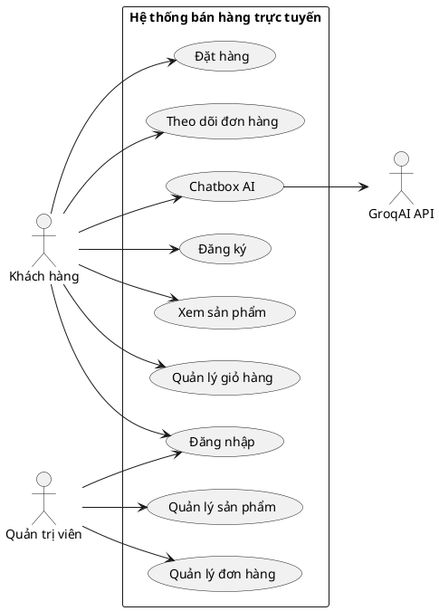
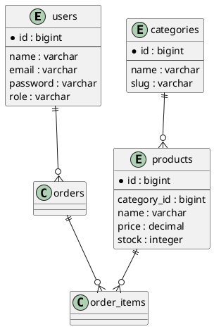

Bạn là AI Agent hỗ trợ viết báo cáo đồ án tốt nghiệp/dự án môn học cho sinh viên CNTT.

Nhiệm vụ của bạn là đọc toàn bộ source code hiện tại của dự án Laravel trong repository này, phân tích cấu trúc, database, models, migrations, routes, controllers, Livewire components, views, service classes và các file cấu hình liên quan. Sau đó viết một báo cáo đồ án đầy đủ bằng Markdown.

Tên file cần tạo:

```txt
BAO_CAO_DO_AN.md
```

Dự án:

```txt
HỆ THỐNG QUẢN LÝ VÀ BÁN HÀNG TRỰC TUYẾN
```

Sinh viên thực hiện:

```txt
- Đồng Thị Ánh - 23013883
- Bùi Thị Hồng Tươi - 23015124
- Nguyễn Minh Phương - 23015738
```

Công nghệ chính của dự án:

```txt
- Laravel
- Livewire
- Blade
- Tailwind CSS
- MySQL
- Eloquent ORM
- GroqAI API cho Chatbox AI
```

Yêu cầu quan trọng:

1. Không viết báo cáo chung chung.
2. Phải dựa trên source code thật trong repository.
3. Nếu trong code có chức năng nào không tồn tại thì không được tự bịa.
4. Nếu có chức năng dự kiến nhưng chưa hoàn thiện, hãy ghi rõ là “định hướng mở rộng” hoặc “chưa triển khai đầy đủ”.
5. Báo cáo phải trình bày cẩn thận, dễ nộp cho giảng viên.
6. Tất cả sơ đồ phải viết bằng PlantUML trong code block markdown dạng:

```plantuml
@startuml
...
@enduml
```



7. Báo cáo cần có đầy đủ các phần sau.

---

# Cấu trúc báo cáo bắt buộc

## 1. Trang bìa thông tin

Bao gồm:

* Tên đề tài
* Sinh viên thực hiện
* Công nghệ sử dụng
* Mục tiêu hệ thống

## 2. Giới thiệu dự án

Trình bày:

* Lý do chọn đề tài
* Mục tiêu xây dựng hệ thống
* Đối tượng sử dụng
* Phạm vi triển khai
* Ý nghĩa thực tiễn

## 3. Khảo sát và phân tích hệ thống

Trình bày:

* Thực trạng mua bán trực tuyến
* Vấn đề cần giải quyết
* Giải pháp hệ thống đề xuất
* Các tác nhân chính của hệ thống

Tác nhân tối thiểu gồm:

```txt
- Khách hàng
- Quản trị viên
- Chatbox AI
```

Nếu trong source code có thêm vai trò khác thì bổ sung theo đúng code.

## 4. Yêu cầu hệ thống

Chia thành:

### 4.1. Yêu cầu chức năng

Dựa vào source code, liệt kê các chức năng thật sự có trong hệ thống.

Các nhóm chức năng thường có thể gồm:

* Đăng ký, đăng nhập, đăng xuất
* Quản lý tài khoản
* Xem danh sách sản phẩm
* Xem chi tiết sản phẩm
* Tìm kiếm/lọc sản phẩm nếu có
* Quản lý giỏ hàng
* Đặt hàng
* Xem lịch sử đơn hàng
* Theo dõi trạng thái đơn hàng
* Quản lý sản phẩm
* Quản lý danh mục
* Quản lý kho/số lượng tồn
* Quản lý đơn hàng
* Quản lý người dùng
* Thống kê/báo cáo nếu có
* Chatbox AI nếu có

Lưu ý: Chỉ ghi chức năng có thật trong code.

### 4.2. Yêu cầu phi chức năng

Bao gồm:

* Bảo mật
* Hiệu năng
* Dễ sử dụng
* Dễ bảo trì
* Khả năng mở rộng
* Tương thích giao diện
* Sao lưu và quản lý dữ liệu

## 5. Đặc tả Use Case

Viết đặc tả use case dạng bảng cho từng chức năng chính.

Mỗi use case cần có:

```txt
- Mã use case
- Tên use case
- Tác nhân
- Mô tả
- Điều kiện tiên quyết
- Luồng xử lý chính
- Luồng thay thế/ngoại lệ
- Kết quả đầu ra
```

Các use case tối thiểu cần mô tả:

```txt
UC01 - Đăng ký tài khoản
UC02 - Đăng nhập
UC03 - Xem danh sách sản phẩm
UC04 - Xem chi tiết sản phẩm
UC05 - Thêm sản phẩm vào giỏ hàng
UC06 - Cập nhật giỏ hàng
UC07 - Đặt hàng
UC08 - Xem lịch sử đơn hàng
UC09 - Theo dõi trạng thái đơn hàng
UC10 - Quản lý sản phẩm
UC11 - Quản lý danh mục
UC12 - Quản lý đơn hàng
UC13 - Cập nhật trạng thái đơn hàng
UC14 - Quản lý người dùng
UC15 - Chatbox AI tư vấn sản phẩm
```

Nếu source code không có use case nào trong danh sách trên thì bỏ hoặc chuyển sang phần định hướng mở rộng.

## 6. Sơ đồ Use Case bằng PlantUML

Tạo sơ đồ Use Case tổng quan bằng PlantUML.

Yêu cầu:

* Có actor Khách hàng
* Có actor Quản trị viên
* Có actor Chatbox AI hoặc GroqAI API nếu trong code có tích hợp
* Các use case phải khớp với chức năng thật trong source code
* Có phân nhóm chức năng bằng package hoặc rectangle

Ví dụ định dạng:



Hãy tự viết lại sơ đồ theo đúng source code thực tế.

## 7. Sequence Diagram

Viết ít nhất 4 sequence diagram bằng PlantUML:

### 7.1. Sequence đăng nhập

Mô tả luồng:

* Người dùng nhập thông tin
* Hệ thống validate
* Kiểm tra tài khoản
* Tạo session
* Chuyển hướng theo vai trò nếu có

### 7.2. Sequence đặt hàng

Mô tả luồng:

* Khách hàng xem giỏ hàng
* Nhập thông tin giao hàng
* Xác nhận đặt hàng
* Hệ thống tạo đơn hàng
* Tạo order items
* Trừ tồn kho nếu code có xử lý
* Xóa/cập nhật giỏ hàng
* Trả kết quả

### 7.3. Sequence quản trị viên cập nhật trạng thái đơn hàng

Mô tả luồng:

* Admin mở chi tiết đơn hàng
* Cập nhật trạng thái
* Hệ thống validate trạng thái
* Lưu trạng thái mới
* Lưu lịch sử trạng thái nếu có bảng lịch sử
* Khách hàng xem được trạng thái mới

### 7.4. Sequence Chatbox AI

Mô tả luồng:

* Khách hàng gửi câu hỏi
* Hệ thống lấy thông tin sản phẩm/đơn hàng nếu có
* Tạo prompt
* Gửi request đến GroqAI API
* Nhận phản hồi
* Lưu lịch sử hội thoại nếu có
* Hiển thị câu trả lời

Mỗi sequence phải có PlantUML riêng.

## 8. Activity Diagram

Viết ít nhất 3 activity diagram bằng PlantUML:

### 8.1. Activity đặt hàng

Mô tả từ lúc khách hàng thêm sản phẩm vào giỏ đến khi tạo đơn hàng thành công.

### 8.2. Activity xử lý đơn hàng của quản trị viên

Mô tả các trạng thái:

```txt
Chờ xác nhận -> Đã xác nhận -> Đang đóng gói -> Đang giao -> Hoàn thành
```

Có nhánh hủy đơn nếu code có hỗ trợ.

### 8.3. Activity Chatbox AI

Mô tả quá trình khách hàng hỏi, hệ thống xử lý prompt, gọi GroqAI và trả lời.

## 9. Phân tích cơ sở dữ liệu

Đọc toàn bộ file migration trong thư mục:

```txt
database/migrations
```

Sau đó viết phần phân tích database.

Yêu cầu:

* Liệt kê đầy đủ các bảng thật sự có trong migration
* Mô tả ý nghĩa từng bảng
* Mô tả các trường quan trọng
* Mô tả khóa chính
* Mô tả khóa ngoại
* Mô tả quan hệ giữa các bảng
* Không bịa bảng không tồn tại

Các bảng có thể có trong hệ thống:

```txt
users
categories
products
product_images
carts
cart_items
orders
order_items
order_status_histories
ai_settings
ai_conversations
```

Chỉ ghi bảng có thật trong source code.

## 10. ERD bằng PlantUML

Tạo ERD bằng PlantUML dựa trên migration thật.

Yêu cầu:

* Dùng cú pháp entity của PlantUML
* Thể hiện đầy đủ bảng chính
* Thể hiện quan hệ 1-n, n-n nếu có
* Tên trường phải theo đúng migration
* Nếu một bảng có nhiều trường, chỉ cần ghi các trường quan trọng

Ví dụ định dạng:



Hãy tự viết lại theo database thật của dự án.

## 11. Mô tả kiến trúc hệ thống

Dựa vào source code Laravel, viết rõ:

* Kiến trúc MVC trong Laravel
* Vai trò của Model
* Vai trò của View Blade/Livewire
* Vai trò của Controller
* Vai trò của Route
* Vai trò của Migration
* Vai trò của Middleware
* Vai trò của Service nếu có
* Cách Livewire được dùng trong giao diện

Nếu project có thư mục riêng như:

```txt
app/Livewire
app/Models
app/Http/Controllers
resources/views
routes/web.php
```

hãy mô tả theo đúng cấu trúc đó.

## 12. Cách training và hoạt động của Chatbox AI

Viết thật kỹ phần này.

Lưu ý: Với GroqAI API, hệ thống không nhất thiết “train model” trực tiếp. Vì vậy cần trình bày đúng kỹ thuật:

* Hệ thống không huấn luyện lại mô hình AI từ đầu
* Hệ thống cấu hình ngữ cảnh cho AI thông qua prompt
* Dữ liệu sản phẩm, danh mục, chính sách mua hàng hoặc trạng thái đơn hàng được đưa vào prompt nếu code có xử lý
* GroqAI xử lý ngôn ngữ tự nhiên và trả về câu trả lời
* Hệ thống hiển thị phản hồi cho khách hàng
* Nếu có lưu lịch sử chat thì mô tả cách lưu
* Nếu có cấu hình API key trong .env thì mô tả cách sử dụng biến môi trường

Cần có các mục:

### 12.1. Mục tiêu của Chatbox AI

### 12.2. Nguồn dữ liệu Chatbox AI sử dụng

### 12.3. Cách hệ thống xây dựng prompt

### 12.4. Quy trình gọi GroqAI API

### 12.5. Cách lưu lịch sử hội thoại

### 12.6. Cách bảo mật API key

### 12.7. Hạn chế và hướng phát triển

## 13. Cài đặt hệ thống

Viết hướng dẫn cài đặt dự án theo source code thật.

Yêu cầu tối thiểu gồm:

```bash
composer install
npm install
cp .env.example .env
php artisan key:generate
```

Vì database sử dụng MySQL, cần hướng dẫn cấu hình `.env`:

```env
DB_CONNECTION=mysql
DB_HOST=127.0.0.1
DB_PORT=3306
DB_DATABASE=dacs_cntt
DB_USERNAME=root
DB_PASSWORD=
```

Sau đó:

```bash
php artisan migrate
php artisan db:seed
npm run dev
php artisan serve
```

Nếu project có storage link:

```bash
php artisan storage:link
```

Nếu project có queue:

```bash
php artisan queue:work
```

Chỉ đưa các lệnh phù hợp với source code.

## 14. Hướng dẫn demo giao diện chính

Viết kịch bản demo theo thứ tự dễ trình bày trước giảng viên.

Tối thiểu gồm:

### 14.1. Demo phía khách hàng

* Mở trang chủ
* Xem danh sách sản phẩm
* Xem chi tiết sản phẩm
* Thêm sản phẩm vào giỏ hàng
* Cập nhật giỏ hàng
* Đặt hàng
* Xem lịch sử đơn hàng
* Theo dõi trạng thái đơn hàng
* Hỏi Chatbox AI

### 14.2. Demo phía quản trị viên

* Đăng nhập admin
* Xem dashboard
* Quản lý danh mục
* Quản lý sản phẩm
* Cập nhật tồn kho
* Xem danh sách đơn hàng
* Cập nhật trạng thái đơn hàng
* Xem thống kê doanh thu nếu có
* Cấu hình hoặc kiểm tra Chatbox AI nếu có

### 14.3. Demo luồng hoàn chỉnh

Mô tả luồng:

```txt
Khách hàng đặt hàng -> Admin xác nhận -> Admin cập nhật trạng thái -> Khách hàng theo dõi trạng thái
```

## 15. Giao diện chính của hệ thống

Dựa vào các file view trong source code, mô tả các giao diện chính:

* Trang chủ
* Trang danh sách sản phẩm
* Trang chi tiết sản phẩm
* Trang giỏ hàng
* Trang đặt hàng
* Trang lịch sử đơn hàng
* Trang theo dõi đơn hàng
* Trang đăng nhập/đăng ký
* Trang dashboard quản trị
* Trang quản lý sản phẩm
* Trang quản lý danh mục
* Trang quản lý đơn hàng
* Trang quản lý người dùng
* Giao diện Chatbox AI

Nếu có ảnh chụp màn hình trong project thì nhúng vào báo cáo. Nếu chưa có ảnh, hãy để placeholder theo dạng:

```md

```

## 16. Đánh giá kết quả đạt được

Viết:

* Những chức năng đã hoàn thành
* Những chức năng còn hạn chế
* Những vấn đề gặp phải
* Cách khắc phục
* Mức độ đáp ứng yêu cầu đề tài

## 17. Hướng phát triển

Gợi ý các hướng mở rộng:

* Tích hợp thanh toán online
* Gửi email thông báo đơn hàng
* Thêm mã giảm giá
* Thêm đánh giá sản phẩm
* Thêm wishlist
* Tích hợp vận chuyển
* Tối ưu Chatbox AI bằng dữ liệu sản phẩm chi tiết hơn
* Xây dựng API cho ứng dụng mobile

Chỉ ghi đây là hướng phát triển, không ghi như chức năng đã hoàn thành.

## 18. Kết luận

Viết phần kết luận trang trọng, phù hợp báo cáo đồ án sinh viên.

---

# Yêu cầu cách viết

* Viết bằng tiếng Việt.
* Văn phong báo cáo đồ án, nghiêm túc, rõ ràng.
* Trình bày Markdown đẹp, có heading đầy đủ.
* Dùng bảng khi đặc tả use case hoặc mô tả database.
* Không viết quá sơ sài.
* Không được bỏ sót các sơ đồ bắt buộc.
* Không dùng icon/emoji.
* Không đưa nhận xét kiểu “tôi không chắc”.
* Nếu không tìm thấy một chức năng trong code, hãy ghi: “Chức năng này chưa được triển khai trong phạm vi hiện tại” ở phần phù hợp.

---

# Các file/thư mục cần ưu tiên phân tích

Hãy kiểm tra kỹ các thư mục/file sau nếu tồn tại:

```txt
routes/web.php
routes/api.php
app/Models
app/Http/Controllers
app/Livewire
app/Services
app/Policies
app/Providers
database/migrations
database/seeders
resources/views
resources/js
resources/css
config
.env.example
composer.json
package.json
README.md
```

---

# Kết quả cần tạo

Tạo file:

```txt
BAO_CAO_DO_AN.md
```

Sau khi tạo xong, hãy tự kiểm tra lại file để đảm bảo có đủ:

```txt
- Đặc tả use case
- Sơ đồ usecase bằng PlantUML
- Sequence Diagram bằng PlantUML
- Activity Diagram bằng PlantUML
- ERD bằng PlantUML
- Phân tích Database
- Cách training và hoạt động của Chatbox AI
- Cách cài đặt hệ thống
- Kịch bản demo giao diện chính
```

Nếu thiếu phần nào, hãy bổ sung trước khi kết thúc.
